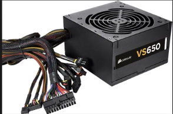
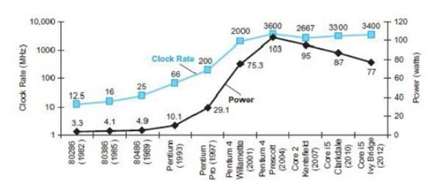

## 전력
### 전력이란
* 전력이란 컴퓨터가 동작하는데에 소비되는 전기의 힘 
* 전력과 클럭속도는 밀접한 관계가 있음
* CPU온도가 낮아지면 전력소모가 줄어듦
* 파워서플라이를 통해 전력을 공급받음 
  
* 
    **PSU**

### 전력과 클럭속도 간의 관계
* 
    **클럭속도와 소비전력의 변화를 나타낸 그래프**
* 파랑 - 클럭속도
  검정 - 전력

* 멀티코어 후부터는 클럭속도를 조금 낮추는 대신에 파이프 라인을 좀더 단순한 구조로 변경하고 프로세서 코어갯수를 늘려는 방식으로 성능을 높임
하지만 냉각기술 때문에 사용할 수 있는 전력에 한계가 있어서 성장의 정체를 보이고 있다.
전력이란 것은 CPU 코어에 따라서도 변경이 된다.

### 전력사용 주 원인
* 트랜지스터는 CPU에 있는 집적회로이다.
* 트랜지스터가 0에서 1로 혹은 그 반대로 스위칭하는 동안에 소비. 
* 트랜지스터가 소비하는 전력은 스위칭시 소모되는 에너지와 시간당 논리값이 바뀌는 빈도수의 곱 (= 소비전력의 총량)

### 전력의 문제점
* 전압을 낮추면 트랜지스터 누설 전류가 커짐
* 전력이 너무 높아지면 온도 또한 올라감 (냉각 비용발생)
