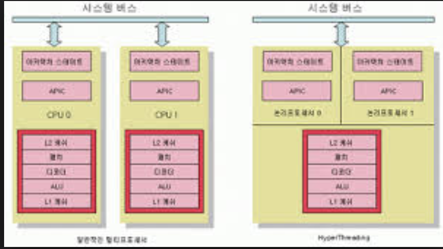

## CPU 발전의 발전
### CPU 발전과정
* 단일프로세서 -> 멀티코어 프로세서 
* 멀티코어 프로세서란 여러 개의 코어를 집적한 프로세서
    (1개의 일을 1명이 하는 것 보다 여려명이 하는것과 같은 원리)
* 파이프라인 구조를 채택하여 병렬성을 높이고 처리량을 최대화함

##### Intel 8086 
* 최초의 16bit 프로세서 (CPU의 아버지라 불리는..)
* PC가 많이 보급되지 않아 성공에는 실패함
* 가성비가 떨어져 아케이드판, 콘솔쪽에도 채용되지 못함 

#### 80386 CPU
* 386이라는 이름으로 유명한 CPU 
    90년에 많이 사용함, 이때 당시는 컴퓨터 이름 자체를 CPU 이름으로 부름
    뒤에 86 이 붙은 프로세서를 intel *86 이라 부름
* 32bit 아키텍쳐로 이루어진 최초의 CPU
    32bit 는 1클럭당 처리할 수 있는 최대 크기를 의미한다.
* PC의 보급화로 전세계적으로 널리사용됨

#### 펜티엄
* 90년대 출시된 가장 고성능 프로세서 , 지금도 나오고 있다.
* 숫자대신 최초로 이름을 갖게된 CPU 
* 클럭속도: 60MHz ~ 300MHz
* 슈퍼스칼라 아키텍쳐 채용 (클럭속도가 낮은 대신에)
* 슈퍼스칼라 아키텍쳐란 파이프라인 두개를 이용해서 한 클럭당 여러개의 명령어가 수행되게 하는 구조

#### 코어 2
* 멀티코어 프로세서
* 클럭속도: 1GHz ~ 3.33GHz
* 코어개수: 1, 2, 4
* 코어이 갯수가 올라가 병렬성이 향상됨, 최초의 멀티코어 프로세서

### 왜 멀티코어를 사용했는가?

#### 암달의 법칙
* 트랜지스터의 증가로 인한 성능향상에 한계점 도달
* 코어 개수를 늘리는 방향으로 CPU의 진화
* 멀티코어 -> 성능 2배 X
* 병렬화 문제에서 기인하여 프로세서 개수만으로는 성능향상에 한계점이 생김
* 암달의 법칙(Amdahl's law)은 암달의 저주로도 불리며 컴퓨터 시스템의 일부를 개선할 때 전체적으로 얼마만큼의 최대 성능 향상이 있는지 계산하는 데 사용된다. 
* 개선 후 실행시간 = 개선에 의해 영향을 받는 실행 시간 / 성능 향상 비율 + 영향을 받지 않는 실행 시간
* 코어여러개의 성능을 제대로 끌어 올릴려면, 일거리를 효율적으로 배분하도록 프로그램을 제작해야 한다.
    즉, 멀티코어에 치적화가 되어 있지 않는다면, 다른 코어에 도움을 받지 못해서 성능향상에 도움이 되지 않는다.

#### i3/i5/i7
* i3 – 2코어 4스레드
* i5 – 4코어 4스레드
* i7 – 4코어 8스레드
* i9
* 하이퍼 스레딩 
    하나의 코어에 또다른 가상코어를 만들어서 실제 CPU 보다 더 많은 코어를 사용하는것 같은 병렬화 스레딩
    
* 오버클럭(4790K,7800K)
    설계되었을때 클럭속도 보다, 강제로 더 높은 속도로 동작 할 수 있게 만듬
    FSB 와 CPU 배수를 높이는 방법

