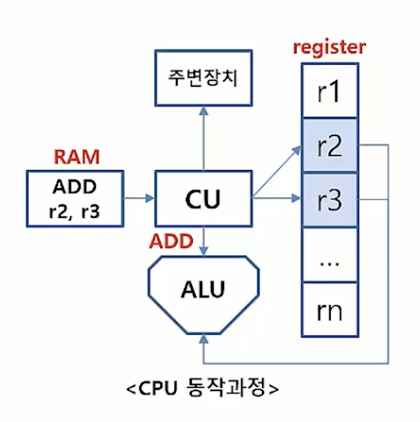

## 컴퓨터란?
### 컴퓨터의 정의 
* 전자회로를 이용하요 데이터를 처리하는 장치
* 방대한 데이터를 저장하고, 자동적으로 계산 세분화 되고 조금더 세밀한 동작이 가능한 계산기
* 입력, 제어, 기억, 연산, 출력 기능 등을 갖추고 있음
* 인류역사에 유례가 없는 발명품

### 컴퓨터는 어떤일을 할 수 있을까?
* 복잡한 계산(미적분, 통계)
* 초정밀 그래픽 구현
* 네트워크 통신

### 컴퓨터의 역사
#### 컴퓨터의 역사 고대
* 계산을 하는 도구로서 가장 처음 만들어진 주판
* 기원전 약 3000년전 고대 메소포타미아에서 사용
* 17세기에 이르도록 주판이 이용됨
  
#### 컴퓨터의 역사 - 중세
* 1642년 프랑스 수학자 파스칼이 톱니바퀴를 이용한 계산기 발명
* 최초의 기계식 계산기(수동)
* 기어로 연결된 바퀴판들로 덧셈과 뺄셈 동작가능
* 1671년 독일의 라이프니츠가 이를 개량해 곱셈과 나눗셈도 가능한 계산기 발명 ( 10진법 X, 2진법 O )

#### 컴퓨터의 역사 - 근현대 (19세기)
* 19세기 중반 영국의 찰스 배비지가 차분엔진을 발명
* 차분엔진은 현대 컴퓨터의 개념을 처음으로 제시함
* 차분기관과 해석기관을 설계하여 제어, 연산, 기억, 입출력이 가능하였음 (범용적)
* 프로그램과 데이터로 구성된 입력에는 천공카드를 사용하였음 (천공카드를 사용하여 같은 연산을 여러번 반복해서 하기에 용이함)
  
#### 컴퓨터의 역사 - 근현대 (1930년대)
* 1930년대에 들어 앨렌 튜링, 알론조 처지등이 계산 가능성 및 불가능성에 대하여 연구 (무엇을 할 수 있고 할 수 없는자에 대한 연구)
대표적인 예로 정지문제가 있다. 정지문제란, 프로그램이 계산을 끝낼지 계속 계산할지 판단 할 수 있는가?
~~~ java
function check(string s)
    if halt(s,s) == false
        return
    else
        loop forever

// 끝 : true
// X : false

//then what about check(check)?
즉, 정지문제는 기계가 판단할수 없다고 입증된 최초의 문제로써 역사적인 의미를 가진다.
튜랑머신
~~~
* 이를 기반으로 튜링머신 탄생
* 튜링머신은 긴테이프에 부호를 기록하여 이를 프로그램처럼 사용했다.
  
#### 컴퓨터의 역사 - 근현대 (1940년대)
* 1941년 독일의 콘라드 추제가 z3발명 (세계최초의 작동가능한, 프로그래밍 가능한 완전 자동 컴퓨터를 개발하였다.)
* 1945년 폰노이만이 stored-program archite를 제안 
* 폰노이만 이전까지는 컴퓨터에게 다른 일을 시키고자 할때 전선을 재배치 하는 식으로 시킴, 하지만 폰노이만 이후에는 sw 를 교체하는 식으로 다른일을 시킴 , 이로 인하여 컴퓨터의 범용성이 크게 향상된다.
* 1946년 미국의 ENIAC 제작 (탄도를 계산하기 위하여)
* 이진법이 아니라 10진수로 작동, 애니악의 무게는 30톤이 넘고 큰 전력을 소모했다.

#### 컴퓨터의 역사 - 현대
* 1960년대 : 초기의 다목적 컴퓨터 IBM 시스템/360 개발 
* 1970냔대 : Thompson 과 Ritchie가 Unix 와 C 개발
* 1970년대 : intel 8008 프로세서 개발 (모든 cpu 의 아버지)
* 1980년대 : 개인용 컴퓨터, intel 프로세서와 MS-dos 를 사용하는 ibm pc등장
* 1980년대 : GUI와 마우스를 사용하는 애플 매킨토시 등장(최초 마우스)
  
#### 컴퓨터의 역사 - 현대 (1900년대)
* 1990년대 : Linus Torvalds가 Linux 개발
* 1990년대 : Microsoft의 Windows 가 등장
* 1990년대 : 인터넷 포털(야후, 구글)등의 등장 WWW   
  
#### 컴퓨터의 역사 - 현대 (2000년대)
* 2000년대 : 컴퓨터를 활용하여 인간 DNA30억 염기서열을 밣히는 Genom Project
* 2000년대 : 애플의 아이폰을 필두로 스마트폰이 쏟아져 나옴 (web 접근성 증가, 데이터의 양 증가)
* 2000년대 : 빅데이터 인공지능의 시대

## 컴퓨터 구조 분야의 8가지 아이디어
### 8가지 아이디어
* 무어(Moore)의 법칙을 고려한 설계
* 설계를 단순화 하는 추상화
* Common case fast
* 병렬성을 통한 성능개선
* 파이프라이닝을 통한 성능개선
* 예측을 통한 성능 개선
* 메모리 계층구조
* 여유분을 이용한 신용도 개선

#### 무어의 법칙을 고려한 설계
* 인텔의 창립자 중 한명인 '고든 무어'의 예측에서 유래
* 18~24개월 마다 칩에 집적되는 소자의 수가 2배가 된다는 법칙
* 컴퓨터를 설계하는 데에는 수년이 걸리기 때문에 집적되는 소자의 수가 2배 내지 4배가 증가함
* 1950년대에서 2000년대 까지의 실제로 CPU에 집작되는 소자에 수를 확인 해본 결과 완벽히 일치하진 않지만, 어느정도 선에서 지켜지고 있다.

#### 설계를 단순화하는 추상화
* 무어의 법칙에 따라 자원의 수가 급격하게 증가함
* 설계시간이 길어 짐으로써 생산성이 낮아짐
* 생산성을 높이기 위하여 추상화 개념을 사용
* 추상화란 하위 수준의 상세한 사항을 안보이게 함으로써 상위 수준 모델을 단순화
* 프로그래밍을 할때 사용하는 고급언어들은 추상화의 대표적인 예로 , 기계어를 추상화 시켜 인간이 인지 할 수 있는 언어로 바꿈 

#### Common case fast
* 자주 발생하는 일을 빠르게 처리하여 성능 향상도모 ( 자주발생하는 일이 무엇인지 예측하는것 부터 )
* Common case에 대한 최적화 및 단순화
* Common case가 무엇인지 알고있다는 가정
* Common case에 대한 세심한 실험과 측정 필요

#### 병렬성을 통한 성능 개선
* 컴퓨터 역사 초기부터 설계자들은 병렬성을 높여 성능을 끌어 올렸다.
* 병렬성이란 큰문제를 여러 개의 작은문제로 나누어서 해결하는 방법
* 병렬처리의 예: 쓰레드 (하나의 프로세스가 여러가지 쓰레드로 나누어져있다.)

#### 파이프라이닝을 통한 성능 개선
* 파이프라이닝은 병렬성의 특별한 형태
* 처음단계 출력이 다음단계 입력으로 이어지는 구조
* 화재를 진압하기 위해서 많은 사람들이 일렬로 늘어서 양동이를 나르는것

##### 로봇 A,B,C
로봇 A,B,C가 각각 손님에게 책을 받아 서가에 둔다면 서가에서 다시 손님에게 오는시간이 든다. 하지만 다음과 같이 움직인다면 시간이 줄어 든다.
1. 로봇 A는 손님에게서 책을 받는다.
2. 로봇 B는 A에게서 받은 책을 어디에 둬야 할지를 확인한다.
3. 로봇 C는 책을 받아, 그 책을 서가로 옮긴다.
4. 서가에 있는 로봇 D는 받은 책을 목적지에 꽂는다.

#### 예측을 통한 성능 개선
* 수요가 예상되는 부분을 예측 (미리 설계)
* 복구비용↓, 성공확률↑일 경우 효과적
* 정확한 예측을 위한 지표가 필요함

#### 메모리 계층구조
* 메모리 계층구조를 통한 문제해결 (하양식으로 접근, 공간적 지역성)
* 최상위 – 비싸고 제일 빠른메모리
* 최하위 – 느리고 값이 싼 메모리

#### 여유분을 이용한 신용도 개선 
* 컴퓨터는 신뢰할 수 있어야함 (믿을수 있는정도)
* 장애대처를 위한 여유분 준비 (가용성)
* 데이터 손실 예방을 위한 백업과 같은 이치

## 컴퓨터의 구성요소
### 컴퓨터의 구성요소
*  입력(Input) : 마우스 키보드 
*  출력(Output) : 모니터
*  메모리(Memory) : 하드디스크 램등의 기억장치
*  데이터패스(Data Path) : CPU
*  제어유닛(Control) : CPU

### 구성요소의 역할
*  프로세서
    * 메모리로 부터 명령과 데이터를 얻음
    * 제어유닛은 프로그램 명령에 따라서 데이터패스, 메모리, 입/출력의 동작을 결정함.
*  메모리
    * 실질적으로 데이터 저장되는 공간
*  입력
    * 데이터를 메모리에 씀
*  출력
    * 메모리로 부터 데이터를 읽음

#### 프로세서의 역할: CPU (중앙처리 장치)
*  메모리로 부터 명령어를 받아와 제어신호를 생성 
*  컴퓨터 명령어(기계어)를 해석하고 연산함
*  컴퓨터 기술을 이끄는 원동력
*  인간의 두뇌와 같은 역할 

#### 프로세서의 역할: GPU (그래픽을 처리하기 위한 프로세서)
*  픽셀로 이루어진 영상을 처리하는 용도로 탄생
*  싱글코어는 CPU보다 저성능이지만 병렬적인 수천개의 코어가 연결되어있음 (반복적이고 비슷한 일을 하는 병렬적인 일을 함.)
*  인공지능 기술발전의 선도주자 (반복적인 일을 하는것에 특화되어 있기 때문에)

#### 프로세서의 동작과정
*  제어유닛(Control Unit, CU) 
*  레지스터(Register) -> 연산결과 등을 임시로 가지고 있음
*  산술/논리 연산장치(Arithmetic/Logic Unit, ALU)
    
제어 유닛(CU) -> 메모리(RAM)로 부터 명령어 해독 -> 제어신호 생성 -> 연산장치(ALU)에게 보냄 -> ALU이 다음 수행동작 결정 -> 제어 유닛(CU)에게 전달 -> 주변장치에 전달

프로세서 안에있는 제어 유닛(CU)은 매모리(RAM)로 부터 명령어를 읽어 들어와서 해독한 후 제어 신호로 만들어 버린다.
이 제어신호를 주변 연산장치인(ALU)에게 전달하게 된다.
이 ALU 는 받은 제어신호를 가지고 연산을 실행하고 그연산된 결과 값을 다시 제어 유닛에게 돌려준다.
이 제어유닛은 결과값을 주변장치에게 출력해준다.

#### 메모리의 역할 (RAM)
*  명령어(프로세스) 및 데이터 적재
*  정보를 저장해 두었다가 필요할 때 읽어들이는 저장소
*  CPU의 register 가 더 속도면에서는 우월한 성능을 가졌으나 용량이 작아서 메모리가 출시됨
*  RAM(휘발성), ROM(비휘발성), 캐시(최근에 사용한데이터) 등
  
#### 입력장치의 역할
*  데이터를 입력하기 위한 컴퓨터의 외부장치
*  키보드, 마우스, 스캐너 등이 있음
*  입력하는 데이터의 유형을 구분하지 않기 때문에 들어오는 데이터의 종류에 따라 다양할 수 있음

#### 출력장치의 역할
*  컴퓨터에서 처리된 결과를 출력해주는 외부장치
*  모니터, 프린터, 스피커 등이 있음

## 기계어와 어셈블리어 고급언어
### Under the program

#### 프로그램의 형태
*  프로그램은 무엇인가?
*  컴퓨터는 어떻게 프로그램을 이해하는가?
*  프로그램이 구동될때 하드웨어는 어떤 동작을 취하는가?
  
프로그램은 인간이 이해 할 수 있는 고급언어와 기계가 이해 할 수 있는 기계어의 번역(컴파일)을 통해서 만들어 진다.

#### 고급언어
*  일반적으로 언급되는 프로그래밍 언어
*  C언어, Python, Java등 (추상화)
*  고급언어를 **컴파일러**가 어셈블리어로 번역

#### 어셈블리어
*  컴파일러로 부터 생성된 어셈블리어는 기계가 이해할 수 있는 형태로 번역됨
*  기계사고방식의 언어
*  어셈블러는 어셈블리어를 기계어로 번역 
  
#### 기계어
*  기계어는 기수가 **2인 숫자로 구성**됨
*  숫자 단위 하나는 **비트(bit)**
*  컴퓨터가 이해할 수 있는 비트들의 집합

### 하드웨어/소프트웨어 계층
#### 시스템 소프트웨어
*  Application software(프로그램 단) 에서 부터 Hardware 까지 공통적으로 필요한 서비스를 제공하는 소프트웨어
*  운영체제, 컴파일러, 로더, 어셈블러
*  프로그램 – 하드웨어간의 인터페이스 역할 

### High vs Low
#### High Level Language
*  기계어를 고도로 추상화한 표현으로써 인간이 이해하기 쉬운형태
*  프로그램을 개발한 기종에 상관없이 어느 컴퓨터에서든 실행가능한 형태
*  컴파일 과정에서 불필요한 instruction이 생성되므로 다소 속도가 느림

#### Low Level Language
*  컴파일러나 어셈블리어가 생성하는 불필요한 instruction을 최소화 가능
*  기계적 사고 방식을 강요하기 때문에 프로그램 구성을 위한 소요가 큼

#### 결론
*  개발에 있어 고급언어가 효율적
*  실행속도에 있어 기계어가 효율적
*  하지만, CPU 기술 발전에 의하여 실행속도 차이가 줄어들었다.

