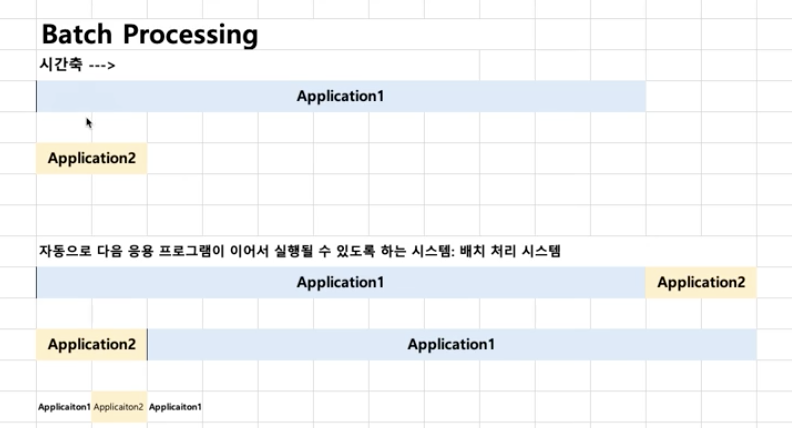
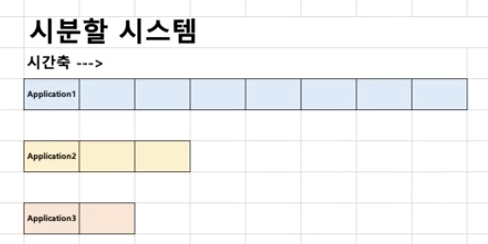
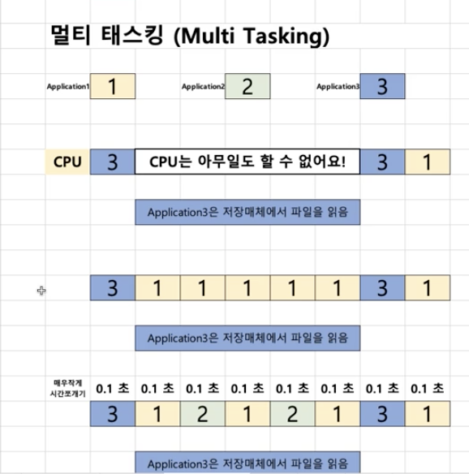
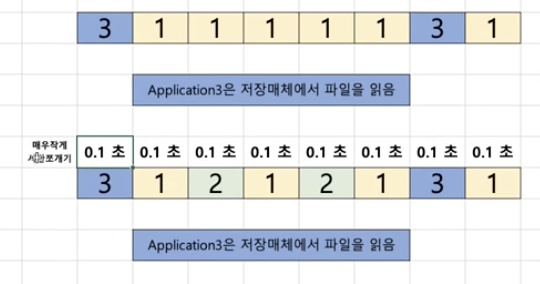

## History로 보는 운영체제

###1950년대 ~ 1960년대

#### 1950년대
**ENIAC: 첫 번째 컴퓨터**
* 운영체제가 없었다. 
    * 왜냐하면, 1개의 응용 프로그램을 실행시키기도 힘들었다.
    * 따라서, 응용 프로그램이 시스템 자원을 제어
* 진공관을 가지고 0,1 을 표현해서 프로그램을 만들었다.
  
> https://youtu.be/kH8gehlirrE

#### 1960년대 초기
프로그램 종류도 많아지고, 사용자도 슬슬 많아지기 시작했다.

~~~
철수: 프로그램1 ‑ 예상 실행 시간 12시간
영희: 프로그램2 ‑ 예상 실행 시작 1분
프로그램1 ‑‑> 프로그램2
프로그램2 ‑‑> 프로그램1
~~~

* 배치 처리 시스템(batch processing system) 출현
    * 여러 응용 프로그램을 등록시켜놓으면, 순차적으로 실행하는 시스템
        1번의 시스템이 실행이 꿑나면 운영체제에서 자동으로 2번 프로그램이 실행이 된다.
        어떻게 배치가 되었지에 따라 실행시간이 다르다.

    * 배치 처리 시스템을 기반으로 운영체제가 출현

아주 과거에는....
> 컴퓨터 학과에 컴퓨터 1대 (배치 처리 시스템을 지원)
    컴퓨터 학과에서 프로그램 과제를 내줍니다. 후배님들은 프로그램 실행(테스트)이 어려웠던적이 있습니다.

    즉, 프로그램을 등록한대로 실행되기 때문에 실행과 관련된 부분들이 적절하게 고려되지 않는 단점이 있었다.

#### 1960년대 후반
* 새로운 개념이 제안됨
    * 시분할 시스템 (Time Sharing System)
    * 멀티 태스킹 (Multi Tasking)
* 아이디어로 제안이 되었지만, 운영체제로 구현되지는 않았습니다.

##### 시분할 시스템과 멀티 태스킹
* 응용 프로그램이 CPU를 사용하는 시간을 잘개 쪼개서, 여러 개의 응용 프로그램을 동시에 실행하는 기법
* **시분할 시스템**: 다중 사용자를 지원하고, 컴퓨터 응답 시간을 최소화하는 시스템
    * 
    * 
        * 다중 사용자 지원 -> 응답시간을 줄여야한다.
        * 즉, 배치시스템에서는 사용 할 수 없다.
  
* **멀티 태스킹**: 단일 CPU에서, 여러 응용 프로그램의 병렬 실행을 가능케 하는 시스템
    빠르게 실행하여, 마치 여러개의 응용프로그램이 동시에 실행되는것 처럼 사용자가 느끼기도록 개발하는것이 목표
    보통은 시분할 시스템 === 멀티 태스킹 (시간을 잘게 쪼개서 사용하기 때문)
    * 플립북 예제 > https://youtu.be/7BW4-IVO5Jc

    * 멀티 프로그래밍 : 시간을 잘개 쪼개서 사용하는 시스템이나 목적이 최대한 CPU를 많이 활용하도록 하는 시스템 이다. (시간대비 CPU 활용도를 높이자)
  
    * 
    * 
    * 운영체제 스케줄러

###### 배치 처리 시스템의 단점
1. 컴퓨터 응답 시간 (response time)이 오래 걸릴 수 있다. (앞단에 실행시간이 많이 필요로 하는 응용 프로그램이 실행될 경우)
2. 실행 시간도 오래걸릴 수 있습니다. (CPU가 필요없음에도 응용 프로그램이 CPU를 점유할 수 있기 때문입니다.)

###### 시분할 시스템/멀티 태스킹
* 핵심 기술: 시간을 잘게 쪼개서, 여러 응용 프로그램을 실행
    * 컴퓨터 응답 시간을 줄일 수 있음 (시분할 시스템, 다중 사용자를 지원)
    * 전체 응용 프로그램의 실행 시간도 줄일 수 있음 (멀티 프로그래밍)
    * 결과적으로, 사용자가 느낄 때에는, 여러 응용 프로그램이 동시에 실행되는 것처럼 보인다. (멀티 태스킹)

### 정리
* 1950년대
    * 운영체제가 없었음
    * 응용 프로그램이 직접 시스템 자원을 제어하며 실행
* 1960년대 초반
    * 배치 처리 시스템 출현, 운영체제가 출현
* 1960년대 후반부 정리
    * 시분할 시스템/멀티 태스킹/멀티 프로그래밍
    * 기술: CPU 시간을 잘개 쪼개기
    * 결과: 다중 사용자 지원, 응용 프로그램 동시 실행