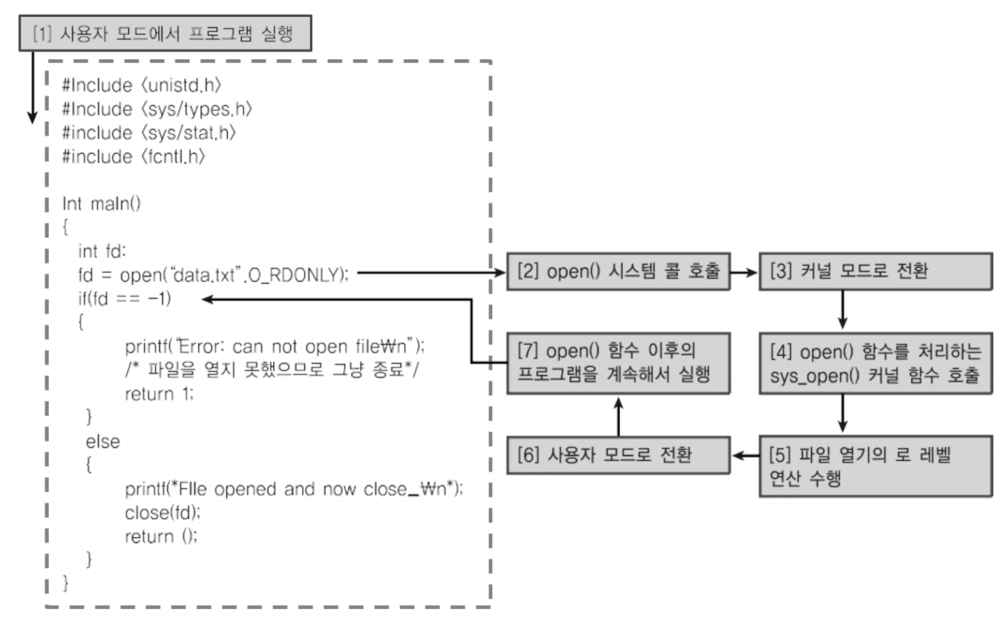
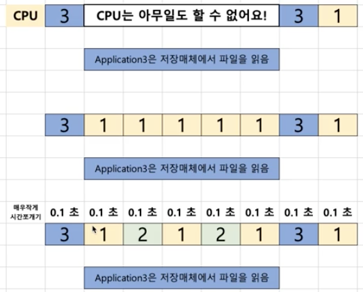
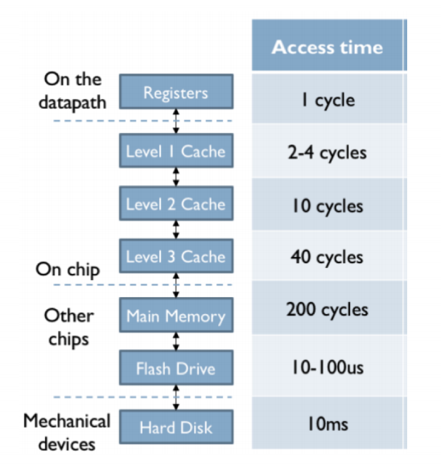
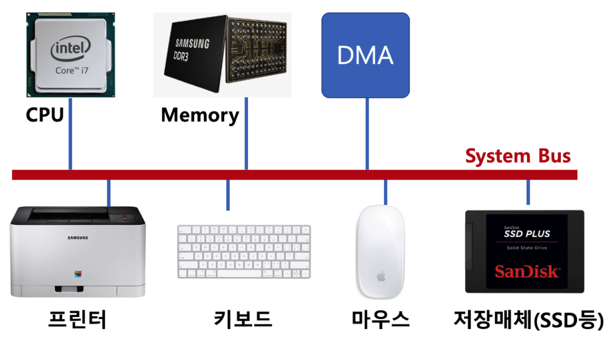

## 프로세스 스케쥴링

### 멀티 프로그래밍

- 최대한 CPU를 많이 활용하도록 하는 시스템
    - 시간 대비 CPU 활용도를 높이자
    - 응용 프로그램을 짧은 시간 안에 실행 완료를 시킬 수 있음

- **응용 프로그램은 온전히 CPU를 쓰기 보다, 다른 작업을 중간에 필요로 하는 경우가 많습니다.** 
    - 예를들어, 
    - 응용 프로그램이 실행되다가 파일을 읽는다. (저장매체는 속도가 느리다.) 파일을 읽을때 까지는 기다려야 한다.
        
    - 응용 프로그램이 실행되다가 프린팅을 한다. 
         만약에 프린트를 하는동안, 운영프로그램이 아무런 일도 하지 못한다면 비효율적이다.

<!--
~~~ c
/* Code example */
/* 1. 사용자 모드에서 프로그램을 실행 */
#include <unistd.h>
#include <sys/lypes.h>
#include <sys/stat.h>
#include <fcnti.h>

int main(){
    int fd;
    fd = open("data.txt" .O_RDONLY); 
    /* 저장매체에서 실제로 오픈이 가능 한지 결과 값을 가져와야 다음 코드를 실행 할수 있다. */
    /*  
        2. open() 시스템 콜 호출  >> 
        3. 커널모드로 변환 >> 
        4. open 함수를처히하는 sys_open() 커널 함수 호출 >>
        5. 파일 열기의 로 레벨 연산 수행 >>
        6. 사용자 모드로 전환 >>
        7. open() 함수 이후의 프로그램을 계속해서 실행 >>
    */
    
    if( id == -1 ){
        printf("Error: can not open file");
        /* 파일을 열지 못했으므로 그냥 종료 */
        return 1;
    }
    else
    {
        printf("File opened and now close_");
        close(fd);
        return ();
    }
}
~~~
-->

* 저장매체에서 실제로 오픈이 가능 한지 결과 값을 가져와야 다음 코드를 실행 할수 있다.

* 1 번의 경우는 파일이 다 읽어지는 동안 다른 일을 하지 못하기 때문에 CPU 전부 활용하지 못한다.
    하지만 2 번의 경우에는 파일이 읽어 지는 동안, 다른 파일이 돌아가기 때문에 CPU 를 전부 활용 할 수 있다.
     

**메모리 계층 ‑ 컴퓨터 구조 복습**

출처: http://computationstructures.org/lectures/caches/caches.html

**System Bus ‑ 컴퓨터 구조 복습**

> 실제로는 시분할 시스템, 멀티 프로그래밍, 멀티 태스킹이 유사한 의미로 통용된다.

* 여러 응용 프로그램 실행을 가능토록 함
* 응용 프로그램이 동시에 실행되는 것처럼 보이도록 함
* CPU를 쉬지 않고 응용 프로그램을 실행토록 해서, 짧은 시간 안에 응용 프로그램이 실행완료될 수 있도록 함
* 컴퓨터 응답 시간도 짧게 해서, 다중 사용자도 지원

### 정리
* 시분할 시스템: 다중 사용자 지원, 컴퓨터 응답시간을 최소화하는 시스템
* 멀티 태스킹: 단일 CPU에서 여러 응용 프로그램을 동시에 실행하는 것처럼 보이게 하는 시스템
* 멀티 프로세싱: 여러 CPU에서 하나의 응용 프로그램을 병렬로 실행하게 해서, 실행속도를 높이는 기법
* 멀티 프로그래밍: 최대한 CPU를 일정 시간당 많이 활용하는 시스템