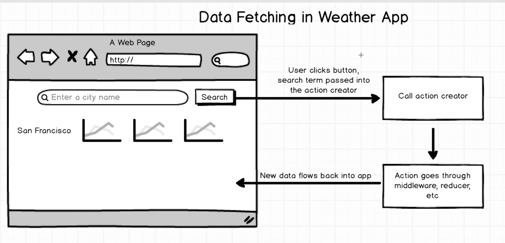
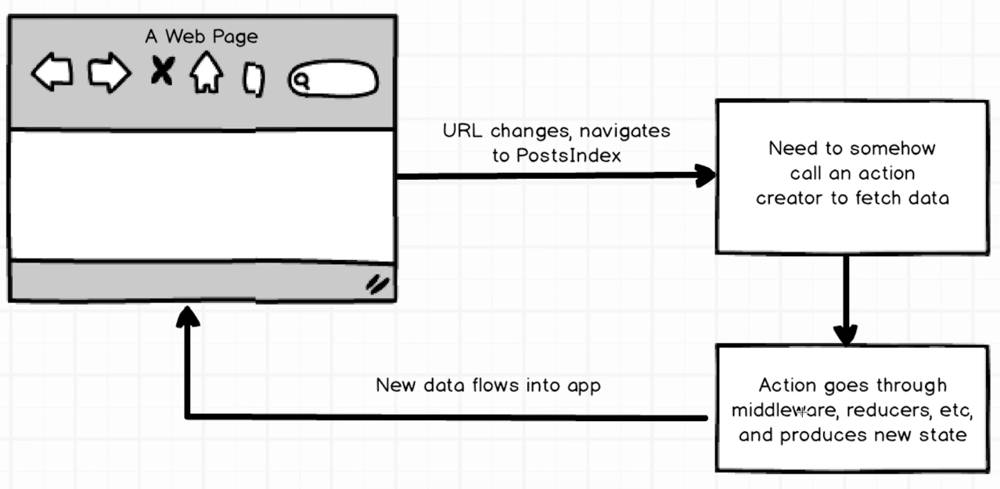

# 리액트 라우터 + 리덕스 폼

## 70. 공지사항

## 71. 앱 오버뷰와 목표

## 72. Posts API 탐험하기

Postman : Get ->  -> Post  -> Get Content -> Delete

## 73. 리액트 라우터 설치하기

상단의 주소바에서 url 을 네비게이팅하면,
이는 현재 위치가 반영되어 페이지가 업데이트 되지요.

유저가 특별한 url을 네비게이팅할때,
이에 적합한 컴포넌트를 화면에 보여줘야 하고,
컨텐츠 또한 함께 보내줘야 하죠.

즉, 해당 url에 맞는 같은 컴포넌트 뿐만 아니라
데이터도 보여줘야합니다.

다음과 같이 리엑트 라우터를 받습니다.

~~~ javascript
npm install --save react-router@2.0.0-rc5
// @2.0.0-rc5 는 특정 버전을 나타납니다.
~~~

## 74. 리액트 라우터는 무엇일까

리액트 라우터와 히스토리 패키지가 어떻게 동작 방법.

히스토리는 작은 자바스크립트 패키지로써, 웹의 url을 관리하기 위해 이용합니다.
url이 변경되는 것을 관찰하다가 이를 업데이트 하는 것이죠.
실제로, 우리는 이 히스토리를 곧바로 작업하지는 않고, 

url이 바뀔때마다 히스토리는 이를 관찰하는데요.
즉, 브라우저는 히스토리 라이브러리가 유저가 url을 바꾼것을 알게하죠.
히스토리가 새 url을 가지면, 리액트 라우터로 전달하고, 리엑트 라우터는 이를 받게되구요.
이 url을 받아서 새로운 컴포넌트를 렌더링 할 필요가 있다고 결정하고,
이를 리액트로 전달하는데요.
리액트가 리액트 라우터로부터 새 컴포넌트를 받으면,
이는 새 컴포넌트의 컬렉션을 얻었다고 감지하게되죠.
그래서, 새로운 컨텐츠를 화면에 보여줄 필요가 있다고 결정하죠.
화면에 이 컨텐츠를 렌더링하고,
컨텐츠를 바로 브라우저로 흘러보내죠.

즉 정리하면 히스토리는 뒷단에서, url을 관찰하다가
필요하면 이를 업데이트 하는 능력이 있구요.
이 url이 바뀌면 리액트 라우터로 이를 전달하구요.
리액트 라우터가 이를 받아, 이 url에 기반하여 보여줄 컴포넌트를 결정하구요.
리액트 라우터가 리액트로 이를 보내면,
리액트는 html을 화면에 표시하죠.
이것이 전체 사이클입니다.

## 75. 리액트 라우터 세팅

히스토리 종류
- 브라우저 히스토리 : 
- 해쉬 히스토리 :
- 메모리 히스토리 : URL 히스토리를 상ㅅㅇ하지 않고, 커스텀아이즈 죈 개별 히스토리를 가질 수 있음

해당 강의로 진행시, 버전문제로 작동하지 않음

1. react-dom , react 버전을 낮춘다.
~~~
// package.json
react-dom : "^15.1.1"
react: "^15.1.1"
~~~

2. react-router 버전을 올리고 그에 맞는 문법을 사용한다.
   

**react-dom , react 버전을 낮춰 진행**

라우터 라이브러리는 히스토리라 불리는 개별 패키지의 번들 형태이다.
히스토리는 url과 상호작용하면서,
이 업데이트된 url을 리액트 라우터로 보낸다.
리액트 라우터는 url을 받고 어떤 컴포넌트를 url에 기반해 보여줄지 결정한다.

## 76. 라우트 구성

각 라우트에 따라 적절한 컴포넌트를 보여줄 필요가 있고, 이러한 룰을 별도로 index.js에서 세팅해야한다.

src/routes.js 를 생성한다.
routes.js 는 url 을 맵핑하여, 해당 컴포넌트를 보여주는 것을 결정하게 한다.
react 와 react-router의 Route, IndexRout 를 상단에 불러 온 후
App 컴포넌트를 정의 한 후 
Route 컴초넌트 안에 각각 URL(path) 에 맞는 화면(컴포넌트) 를 연결해 준다. 
routes.js 를 작성 한 후에는 

index.js로 돌아와 이를 라우터에 맵핑한다.
상단에, 해당 라우트를 불러온 후 이 맵핑을 라우터에 연결한다.

## 77. 중첩된 라우트

## 78. 리액트 라우터의 인덱스 라우트

리액트 라우터로 유저가 네비게이트할 수 있는 여러 라우트를 추가하기 

## 79. 리덕스로 돌아오기 - 인덱스 액션

~~~
npm install --save axios redux-promise
~~~

Axios 와 redux-promise 를 설치해서 네트워크 리퀘스트를 만들수 있게 해준다.

## 80. 포스트 리듀서의 데이터 잡기 1

**리듀서를 구현하여 데이터를 가져오고 어플리케이션 스테이트로 만든다.**

리듀서를 작성하기전에,
index.js 파일에 combineReducers 를 통해 연결하는 작업이 필요합니다.
상단에 PostsReducer 를 불러오고, 기존의 스테이트를 대체한다.

~~~ javascript
// reducers/index.js 
import { combineReducers } from 'redux';
import PostsReducer from './reducer_posts';

const rootReducer = combineReducers({
  posts: PostsReducer
  // 기존의 스테이트를 PostsReducer 로 대체한다.
});

export default rootReducer;
~~~

리듀서 안에 reducer_posts.js 파일을 생성한다.

~~~ javascript
// reducers/reducer_posts.js 

import { FETCH_POSTS } from '../actions/index';
// 생성한 액션을 상단에 액션 타입을 불러온다.

const INITIAL_STATE = {};
// 초기 스테이트 오브젝트를 정의

export default function(state = INITIAL_STATE , action){
    // 스테이트는 초기화 한다. 기본적으로 초기 스테이트는 오브젝트이다.
    switch(action.type){ // 액션 타입에 따라 스위치 구문으로 분기

        case FETCH_POSTS :
        // post_index 를 성공적으로 가져오는 케이스를 추가
        // FETCH_POSTS 케이스를 추가한다.

        default :
        //액션이 특별히 없으면 default 를 이용해서 스테이트를 바로 반환한다.
            return state;
    }
    // 기본적으로 하나의 함수가 있고, 스위치 구문을 통해
    // 모든 액션 타입들을 분기한다.
}
~~~

만약 해당 스테이트를 실수로 배열인데 오브젝트 형태로 만들었다고 하면,
나중에 리팩토링 할 수 있지만.
스테이트를 리팩토링하는 것은 전체적인 앱에 영향을 주기 때문에 되도록 피해야한다.
따라서, 적어도 어떤 스테이트일지 확고하게 처음에 정의하는 것을 추천한다.

예제로 돌아와서, 
인덱스 페이지는 블로그 포스트 리스트를 보여주고 이는 오브젝트나 배열 형태로 표시되어야 한다.

즉, 블로그 포스트 리스트와 블로그 포스트는 차이가 있다.
이는 블로그 포스트 리스트에 의존할 수 없고, 개별의 스테이트가 현재 활성화된 블로그 포스트를 가져야 하죠.

따라서, 두개의 스테이트가 있다.
하나는 배열로서, 블로그 포스트 리스트에 타이틀과 카테고리를 가지며
다른 하나는 액티브 포스트로서, 현재 디테일 페이지에 보여지는 것이고,
이는 해당 컨텐츠를 포함한다.

~~~~ javascript
// reducers/reducer_posts.js 
import { FETCH_POSTS } from '../actions/index';

const INITIAL_STATE = { all : [], post : null };
// 초기화 스테이트에 반영

// 1. all : []
// 블로그 포스트 리스트를 나타내고, 인덱스 페이지에서 보여준다.
// 다른 곳과 커뮤니케이션 용도로 만든다.

// 2. post : null
// 개별 포스트를 보여주는 부분
// 포스트 하나를 가지고, 기본값으로 null을 가진다.

export default function(state = INITIAL_STATE , action){
    switch(action.type){
        case FETCH_POSTS :

        default :
            return state;
    }
}
~~~~

## 81. 포스트 리듀서의 데이터 잡기 2

**블로그 포스트를 리듀서와 연결**

~~~ javascript
// reducers/reducer_posts.js 
import { FETCH_POSTS } from '../actions/index';

const INITIAL_STATE = { all : [], post : null };

export default function(state = INITIAL_STATE , action){
    switch(action.type){
        case FETCH_POSTS :
        // FETCH_POSTS 액션이 흘러가면
        //  블로그 포스트 리스트를 포함한 어플리케이션 스테이트를 반환한다.

            return { ...state , all : action.payload.data };
            // 새 오브젝트를 반환한다.
            // 해당 새로운 버전의 스테이트와
            // action.payload.data 를 추가한다.

            // 새 오브젝트는 현재 스테이트와 프로퍼티가 추가되었다.
            // 이는 블로그 포스트 데이터이고, API의 반환값이다.

        default :
            return state;
    }
}
~~~

## 82. 라이프사이클 메소드 안에 데이터 가져오기 1

블로그 포스트를 가져오는 로직은 완료되었지만, 
액션 생성자를 호출하거나 데이터 리스트를 가져오는 것이 필요하다.

앱에서 액션 생성자를 불러서 데이터를 가져오는 프로세스를 시작하는데,
언제 어떻게 데이터를 가져오는지에 대해 생각해보자.

먼저 기존에 만들었던 날씨 앱을 생각해보자.

날씨 앱에서는
유저는 인풋에 샌프란시스코와 같은 도시를 타이핑하고 검색 버튼을 클릭하면,
응답으로 액션 생성자를 호출하고 이는 액션을 반환하고,

액션은 미들웨어로나 리듀서로 들어간다.
그리고 나서 데이터는 앱으로 돌아온다.

블로그 포스트 다이어그램을 보면,
클릭 이벤트에 처럼 언제 액션 생성자를 호출할지에 대한 것이 없고,

post_index 컴포넌트를 네비게이팅할 때 (로그 포스트 앱은 url이 변할 때) 데이터를 가져와야 한다.

액션 생성자를 호출하면, 같은 프로세스를 반복한다.
액션이 미들웨어 리듀서로 흘러가고 새로운 데이터가 스테이트로 흘러간다.

"url이 변할 때"를 다루기 위해, 리액트 "라이프 사이클"이라 부르는 것을 사용할 것이다.

**라이프사이클 메소드는** 
리액트에서 기본적으로 제공해주는 매소드 이며, 다양한 메소드가 있는데, 
그 중 하나는 **componentWillMound**라는 것이다.

~~~ javascript
// components/posts_index.js
import React, { Component } from 'react';

class PostsIndex extends Component{

    componentWillMount(){
        console.log("this componentWillMount");
    }
    // 라이프사이클 메소드인 componentWillMount 를 정의 한다.

    render() {
        return (
            
List of blog posts

        )
    }
}

export default PostsIndex;
~~~

파일을 저장하고, 앱이 새로고침 하면 componentWillMount() 메소드가 실행되는것을 볼 수 있다.

이 포스트를 가져올 액션 생성자를 호출할 좋은 시점이다.

componentWillMount 는 라이프사이클 메소드이다.

해당 함수는 컴포넌트가 처음 DOM에 렌더링 되자마자
자동적으로 호출되는 것이며, 이는 리렌더링될때 다시 호출되지 않는다.

즉, 한번만 호출되며 이는 액션 생성자를 두고 데이터를 가져올 최적의 위치 이다.

이 어플리케이션에서는 PostsIndex 컴포넌트가 마운트되자마자, componentWillMount() 메소드 실행하여 데이터를 가져올 것 이다.

## 83. 라이프사이클 메소드 안에 데이터 가져오기 2

지난 시간에 블로그 포스트 리스트를 유저에게 보여줄 때
데이터를 가져오기 위해 액션 생성자를 호출해야하는 것을 알게 되었다.

앱은 url이 변할때 액션 생성자를 호출하기 위해서, 
post_index 컴포넌트 안의 componentWillMount 라이프사이클 메소드에서 액션 생성자를 호출한다.

이 componentWillMount 메소드는 라이프사이클 메소드로서, 
자동적으로 리액트에 의해 호출되며, 
DOM이 처음으로 렌더링되자마자 일어난다.

이번 시간에는 FETCH_POST 액션 생성자를 componetWillMount 메소드에 가져올것이다.
이는 컴포넌트가 마운트되자마자, 데이터는 자동적으로 로드를 시작할 것이다.

~~~ javascript
// components/posts_index.js

import React, { Component } from 'react';
import { connect } from 'react-redux';
import { bindActionCreators } from 'redux';
import { fetchPosts } from '../actions/index';
// connect 와 액션 생성자를 불러온다.

class PostsIndex extends Component{
    componentWillMount(){
        this.props.fetchPosts();
        // componentWillMount 함수 안에 호출할 액션 생성자를 불러온다.
    }

    render() {
        return (
            
List of blog posts

        )
    }
}

function mapDispatchToProps(dispatch){
    return bindActionCreators({fetchPosts},dispatch)
}
// mapDispatchToProps 함수를 정의한다.

export default connect( null , mapDispatchToProps )( PostsIndex );
// 컴포넌트를 mapDispatchToProps 와 연결 한다.
// connect 함수의 첫번째 요소로서 mapStateToProps 를 가지는데, 이 경우에는 해당 함수가 없다.
// 첫번째 요소를 null로 할당하고, 아직 해당 스테이트를 맵핑할 필요는 없다.
// PostsIndex 를 넣는다.
// 이는 fetchPosts 를 접근하고, 이를 컴포넌트에서 호출할 수 있다.

~~~

새로고침을 하여, 네트워크 리퀘스트를 확인해보면
구체적으로 posts 리퀘스트를 요청하는데, 여기에 키가 있고
200 상태값을 얻는다.

posts_index 를 리팩토링 해보면 

~~~ javascript
// components/posts_index.js
import React, { Component } from 'react';
import { connect } from 'react-redux';
import { fetchPosts } from '../actions/index';

class PostsIndex extends Component{
    componentWillMount(){
        this.props.fetchPosts();
    }

    render() {
        return (
            
List of blog posts

        )
    }
}

export default connect( null , { fetchPosts: fetchPosts }
~~~

과거에 모든 프로젝트에서 보일러플레이트로 mapDispatchToProps 를 사용했었다.

하지만 여기서는 이것을 변결 할수 있다.

mapDispatchToProps 함수 전체를 지우고,
대신에 오브젝트로 fetchPosts 를 전달 할 수 있다.

이것은 여전히 이 컴포넌트안에 fetchPosts 를 접근할 수 있고, 
mapDispatchToProps 와 같은 것을 추가할 필요도 없다.

이렇게 코드를 축약할 수 있고, 상단에 bindActionCreators 또한 필요없다.

여기에 ES6를 사용하여 리팩토링을 할 수 있다.

~~~ javascript
{ fetchPosts: fetchPosts }
// 는 es6 를 이용해서 
{ fetchPosts }
// 로 축약가능하다.
~~~

여기 같은 키와 같은 값을 가지고 있어서, 이것은 위와 같이 하나로 합칠 수 있다.

정리하자면,

데이터를 가져오기 위한 방법으로 액션을 디스패치하는데.
이는 post_index 컴포넌트가 DOM을 렌더링 하자마자 발생한다.

이 어플리케이션 안에서는
post_index 가 DOM 에 마운트하는 시점에 데이터를 로딩해야 한다.

데이터를 가져올 때를 아는 것은
딱 떨어지는 문제가 아니라, 복잡할 수 있다.

그래서, 다음에 앱을 만들때, 어디에 액션 생성자를 만들면 좋을지 잘 생각해서 넣어보며,
어디에 데이터를 가져올지에 대해서 생각해봐야 한다.

## 84. 새 포스트 생성하기

## 85. 링크 컴포넌트 네비게이션

## 86. 폼과 폼 제출

## 87. 폼과 폼 제출 보다 자세히 알아보기

## 88. 컨트롤을 리덕스 폼으로 전달하기

## 89. CreatePost 액션 생성자

## 90. 폼 검증 1

## 91. 폼 검증 2

## 92. 제출 네비게이팅

## 93. 포스트 인덱스

## 94. 다이나믹 라우트 파라미터

## 95. 렌더링 시, 데이터 로딩

## 96. Null 프로퍼티 핸들링

## 97. 액션 생성자 지우기

## 98. Delete 네비게이팅

## 99. 리액트 라우터와 리덕스 폼 리뷰
