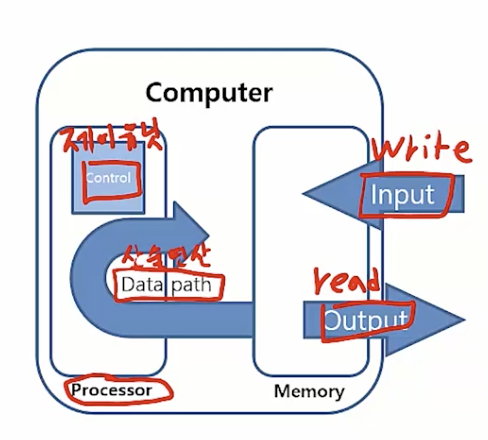
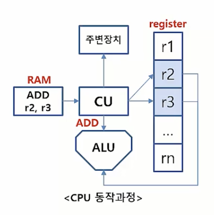

## 컴퓨터의 구성요소 및 역활
### 컴퓨터의 구성요소
*  입력(Input) : 마우스 키보드 
*  출력(Output) : 모니터
*  메모리(Memory) : 하드디스크 램등의 기억장치
*  데이터패스(Data Path) : CPU 안에서 어떻게 전선으로 이으는지
*  제어유닛(Control) : 명령어에 관해서 CPU가 어떻게 처리하는지 

### 구성요소의 역할
*  프로세서
    * 메모리로 부터 명령과 데이터를 얻음
    * 제어유닛은 프로그램 명령에 따라서 데이터패스, 메모리, 입/출력의 동작을 결정함.
*  메모리
    * 실질적으로 데이터 저장되는 공간
*  입력
    * 데이터를 메모리에 씀
*  출력
    * 메모리로 부터 데이터를 읽음

#### 프로세서의 역할: CPU (중앙처리 장치)
*  메모리로 부터 명령어를 받아와 제어신호를 생성 
*  컴퓨터 명령어(기계어)를 해석하고 연산함
*  컴퓨터 기술을 이끄는 원동력
*  인간의 두뇌와 같은 역할 

#### 프로세서의 역할: GPU (그래픽을 처리하기 위한 프로세서)
*  픽셀로 이루어진 영상을 처리하는 용도로 탄생
*  싱글코어는 CPU보다 저성능이지만 병렬적인 수천개의 코어가 연결되어있음 (반복적이고 비슷한 일을 하는 병렬적인 일을 함.)
*  인공지능 기술발전의 선도주자 (반복적인 일을 하는것에 특화되어 있기 때문에)

#### 프로세서의 동작과정
*  제어유닛(Control Unit, CU) 
*  레지스터(Register) -> 연산결과 등을 임시로 가지고 있음
*  산술/논리 연산장치(Arithmetic/Logic Unit, ALU)
    
제어 유닛(CU) -> 메모리(RAM)로 부터 명령어 해독 -> 제어신호 생성 -> 연산장치(ALU)에게 보냄 -> ALU이 다음 수행동작 결정 -> 제어 유닛(CU)에게 전달 -> 주변장치에 전달

프로세서 안에있는 제어 유닛(CU)은 매모리(RAM)로 부터 명령어를 읽어 들어와서 해독한 후 제어 신호로 만들어 버린다.
이 제어신호를 주변 연산장치인(ALU)에게 전달하게 된다.
이 ALU 는 받은 제어신호를 가지고 연산을 실행하고 그연산된 결과 값을 다시 제어 유닛에게 돌려준다.
이 제어유닛은 결과값을 주변장치에게 출력해준다.

#### 메모리의 역할 (RAM)
*  명령어(프로세스) 및 데이터 적재
*  정보를 저장해 두었다가 필요할 때 읽어들이는 저장소
*  CPU의 register 가 더 속도면에서는 우월한 성능을 가졌으나 용량이 작아서 메모리가 출시됨
*  RAM(휘발성), ROM(비휘발성), 캐시(최근에 사용한데이터) 등
  
#### 입력장치의 역할
*  데이터를 입력하기 위한 컴퓨터의 외부장치
*  키보드, 마우스, 스캐너 등이 있음
*  입력하는 데이터의 유형을 구분하지 않기 때문에 들어오는 데이터의 종류에 따라 다양할 수 있음

#### 출력장치의 역할
*  컴퓨터에서 처리된 결과를 출력해주는 외부장치
*  모니터, 프린터, 스피커 등이 있음