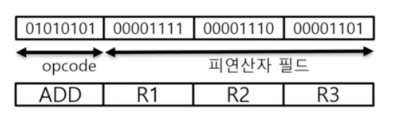

## 컴퓨터의 명령어란

### 명령어

#### 명령어(Instruction)의 정의

* 컴퓨터가 하드웨어에게 일을 시키기위한 수단
* 명령어는 위에서 아래로 흐르는 **하향식** 접근구조
* 다음 명령어를 가르키(저장하는)는 레지스터(Instruction Pointer)에 따라서 명령어를 실행함

#### Instruction Pointer

* 현재 실행되고 있는 프로그램의 **실행코드**가 저장된 **메모리의 주소**를 가르키는 상태 레지스터.
    * 현재 실행되는 명령어가 실행 될때, 다음 올 명령어의 주소 값이 저장되어 있어, 지금 실행되는 명령어의 실행이 끝나면,
    Instruction Pointer 에 따라서 다음 올 명령어가 실행과정이 옮겨진다.

* 프로그램의 실행이 진행됨에 따라 자동으로 증가함.
* 프로그램의 실행 순서가 변경되는 **제어문**이 실행될 때 자동으로 변경됨.
* 직접 접근이 불가한 레지스터
    * 프로그램이 설계자의 의도 대로 작동하게 하기 위해서 임의 변경이 불가능 하다.

#### 명령어 집합구조(Instruction Set Architecture)

* 프로세서가 인식해서 기능을 이해하고 실행할 수 있는 기계어.
* 명령어 집합구조는 1대1 대응되는 어셈블리로 표현 가능함. 기계어를 어셈블리어로 번역이 가능함
* 명령어 집합구조에는 MIPS(32b), ARM, x86, RISC-V 등이 있음

#### 명령어 집합구조(ISA) 설계

* 명령어 집합 구조는 작성된 프로그램과 그 프로그램을 수행할 컴퓨터 하드웨어 사이의 인터페이스에 대한 완전한 정의 혹은 **명세**
* 하드웨어 기술이나 컴퓨터의 구성, 플랫폼이 될 운영체제 등을 고려해야 하는 매우 어려운 작업

#### 명령어 집합구조(ISA) 설계 세부 정의

* 연산의 종류:
    * 처리연산, 제어연산, 입출력연산 등
* 데이터 형식 (Data Type):
    * 데이터의 의미, 데이터 값 저장방식(정수, 실수, 논리) 등
* 명령어 형식 (Instruction Type):
    * 명령어 구성부분을 나타내는 양식
* 피연산자를 위한 주소지정방식 (Addressing Mode):
    * 피연산자의 위치를 명시하는 방법
    * 메모리 or 레지스터

#### 명령어의 구조

* 명령어는 크게 두 부분, 실행코드(opcode)와 피연산자(operand) 부분으로 구성됨
