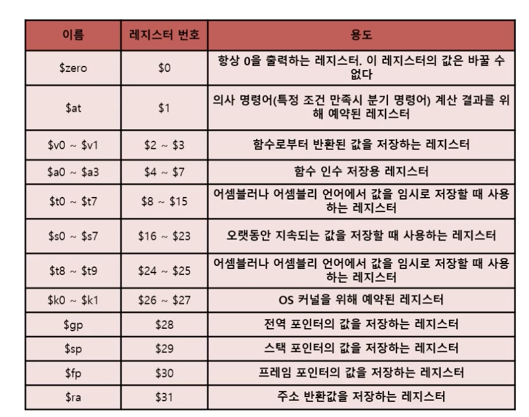
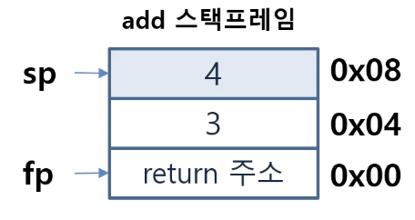

## 산술연산

### 산술연상의 정의

* 산술 연산은 덧셈, 뺄셈, 곱셈, 나눗셈 **사칙연산**의 계산을 하는것
* 컴퓨터는 레지스터와 ALU를 통해 산술연산을 수행한다.

### MIPS

#### MIPS 산술명령어

* MIPS 산술연산자는 반드시 한종류의 연산만 지시
* MIPS 산술명령어는 항상 변수 세개를 갖는 형식
* 피연산자가 반드시 3개인 이유
    * 간단하게 설계(간단하지만 최적화된 명력어 실행구조) 하기 위해서, 규칙적인 것이 좋다.
* MIPS 산술 명령어를 통해 b,c,d,e의 합을 a에 넣는 경우
    1. add a,b,c : b와 c 를 더해 a 에 저장
    2. add a,a,d : a와 d 를 더해 a 에 저장
    3. add a,a,e : a와 e 를 더해 a 에 저장

#### MIPS 레지스터 

* 산술 논리 제어 등의 연산을 위하여, MIPS 명령어 구조에서 제공하는 레지스터
* 레지스터는 컴퓨터가 사용하는 변수라고 이해하면 편하다.

**MIPS에서 제공하는 레지스터**

#### 스택프레임

* 함수가 실행될때 마다 함수 자신만이 사용가능한 고유한 메모리 stack 영역이다.
* 함수의 스택프레임 시작점은 fp가 가르킨다.
* 함수의 종료시에 해제되고 리턴 주소로 복귀 한다.

~~~ c
int add(int a, int b){
    return a+b;
}

int main(){
    printf("%d",add(3,4));
    printf("hello World!\n");

    return 0;
}
~~~
add 가 실행되면 add의 스택 프레임이 생성된다. 

### 고급언어와의 관계

* A = B+C;
* D = A-E;
    * A~E 는 $s1 ~ $s5에 저장 되어 있다고 가정
        * add $s1, $s2, $s3
        * sub $s4, $s1, $s5
