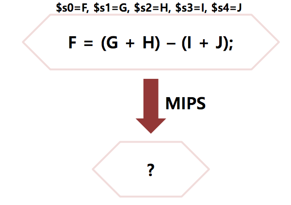
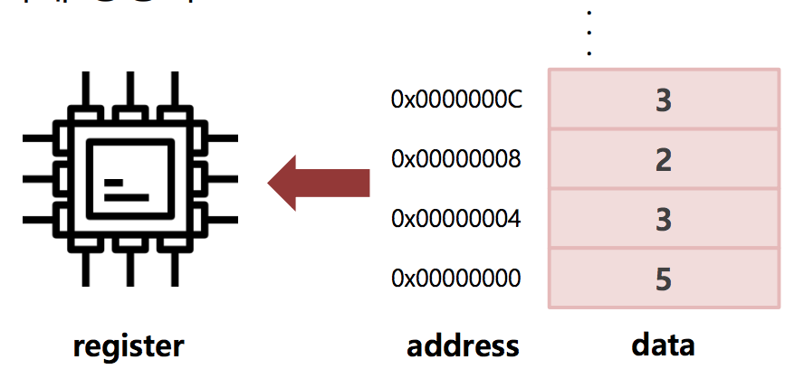
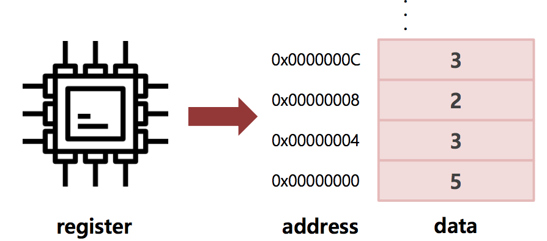
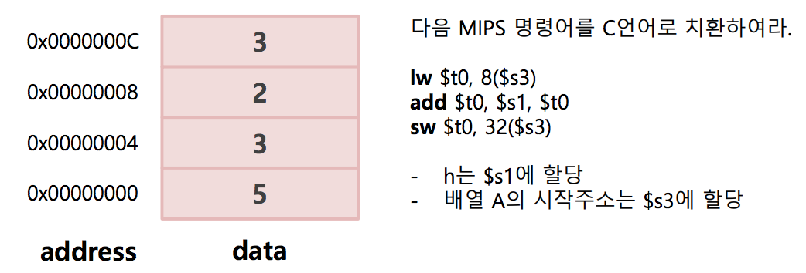

## 피연산자

### 피연산자(operand) 개요

* 연산자의 정의된 연산을 하기위하여 사용되는 레지스터나 상수, 레이블, 메모리주소 등을 뜻하는 말.
* 레지스터는 데이터를 저장하는 장치중 속도가 가장 빠른 장소이므로 일부 레지스터만 사용가능.
* 더 적은 레지스터를 필요로 하는 순서로 연산을 함으로써 더 많은 피연산자를 레지스터에 할당할 수 있게 된다.

### 피연산자 데이터 단위

|데이터 단위 |크기|
|:--------|:--------:|
|word |32 bit|
|half word |16 bit|
|byte |8 bit|

MIPS 명령어(instruction) 및 레지스터는
**32비트**로 구성되어있음

### 연습문제 1

### 연습문제 2

### 메모리 주소 접근

#### 메모리 피연산자

* 프로그래밍 언어에는 단순 변수가 아닌 자료형이 존재(EX. 구조체, 배열)
* 레지스터는 소량의 데이터만 저장할 수 있기 때문에 나머지 데이터는 메모 (Heap,Stack)에 저장 후 주소에 접근하여 사용함
* 메모리와 레지스터간 데이터를 주고받는 명령어를 데이터 전송 명령어(Data Transfer Instruction)이라고함.

#### 적재 명령어

* 메모리는 주소가 인덱스의 역할을 하는 일차원 구조
* 메모리에서 레지스터로 데이터를 복사해 오는 데이터 전송 명령어를 적재(Load)라고 함
* 적재 명령어는 연산자(lw) + 값을 저장할 레지스터 + 메모리 접근에 사용할 상수 및 레지스터로 구성됨
* 4($s3) == [Memory address + 4]

#### 적재 명령어

#### 연습문제 1

#### 연습문제 2
lw $t0, 4($s3) # $t0 = Memory[$s3+4]
add $s1, $s2, $t0 # $s1 = $s2 + $t0

- 데이터 전송명령어 상수 부분(4)를 **offset**이라고함
- 자료구조의 시작주소를 가르키는 레지스터를 **Base register**라고함
- MIPS에서 시작주소는 항상 4의 배수여야 한다(**정렬 제약**)

#### 저장 명령어
* 적재와 반대로 레지스터에서 메모리로 데이터를 보내는 명령을 저장(store)이라고 함.
* 적재명령어와 같은구조
* 연산자(sw) + 저장할 데이터를 가진 레지스터 + 메모리 주소 레지스터 및 상수(offset)의 조합

### 메모리 주소 접근

#### 저장 명령어

#### 연습문제 3

#### 연습문제 4

**A[8] = h + A[2]**

- 배열 A의 인덱스 2에 접근하기 위해서는 2*4 = 8을 $s3에 더해야함
- 배열 A의 인덱스 2의 값을 임시레지스터 $t0에 저장
- $s1에 저장된 h의 값과 add 연산
- sw연산을 이용하여 A[8]에 값을 저장하기 위해서는 베이스 레지스터에 8*4 = 32의 값을 더해야함

### 수치 피연산자

#### 수치연산

* 프로그램 연산에서 레지스터가 아닌 상수를 사용하는 경우
* 상수 필드를 갖는 산술 명령어를 사용시 메모리에서 적재하는것 보다 효율적
* 사용빈도가 높으면 상수를 명령어에 포함하는 것이 좋음(Common case fast)
* 연산자: addi(add와 같은구조)

#### 연습문제 4

**A[8] = h + 10**

- h는 $s1에 저장되어 있다
- 배열 A의 베이스 레지스터는 $s3이다
- 위 C언어 구문을 MIPS 명령어로 치환하시오.

#### 연습문제 4
addi $t0, $s1, 10 # $t0 = h + 10
sw $t0,32($s3) # A[8] = $t0
