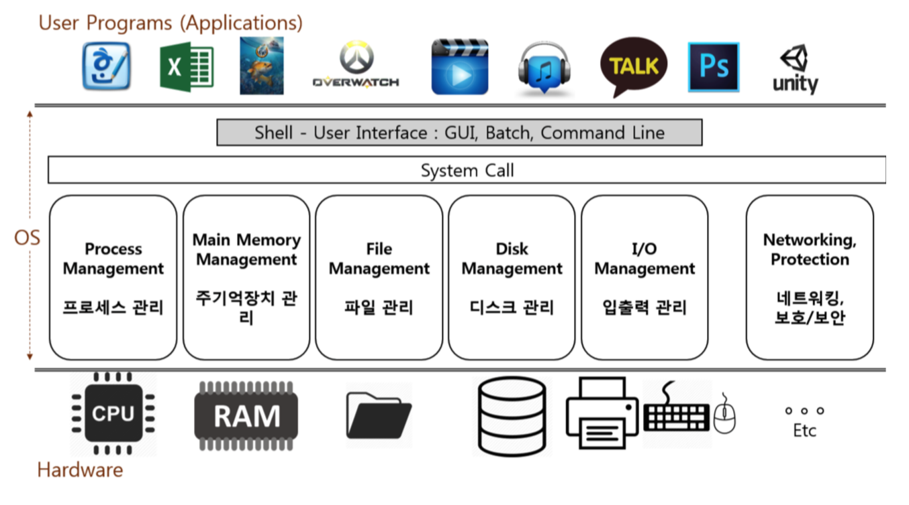

## 운영체제 역할 큰 그림으로 이해하기

### 운영체제 역할1: 시스템 자원(System Resource) 관리자
* Operating System 또는 OS 라고 부릅니다.
* 시스템 자원(System Resource) = 컴퓨터 하드웨어
    * CPU (중앙처리장치), Memory (DRAM, RAM)
    * I/O Devices (입출력장치 -  Monitor, Mouse, Keyboard, Network)
    * 저장매체: SSD, HDD (컴퓨터를 꺼도 데이터가 저장 된다.)

#### 컴퓨터 하드웨어는 스스로 할 수 있는 것이 없다.

1. CPU: 각 프로그램이 얼마나 CPU를 사용할지를 결정할 수는 없음. 
2. Memory: 각 프로그램이 어느 주소에 저장되어야 하는지, 어느 정도의 메모리 공간을 확보해줘야 하는지를 결정할 수는 없음.
3. 저장매체(HDD, SSD): 어떻게, 어디에 저장할지는 결정할 수 없음.
4. 키보드/마우스: 스스로 표시할 수는 없음

**그래서 운영체제가 필요하다.**

#### How did we ever run Computer wihtout OS?
OS 미설치된 노트북
출처: https://youtu.be/e9FrlIvlN38?t=29s

#### 대표적인 운영체제
* Windows OS, Mac OS, 그리고 UNIX(유닉스)
* UNIX OS
    * UNIX 계열 OS
        * UNIX와 사용법이나, OS 구조가 유사
    * LINUX (리눅스) OS
        * 프로그래머, 전공자

#### 쉬어가기: OS는 만들기가 쉽지 않다.
* TmaxOS 시연
    출처: https://youtu.be/OylmhpqptkY
* Windows 시연
    출처: https://youtu.be/nA2SQcaB0ok

### 운영체제 역할2: 사용와 컴퓨터간의 커뮤니케이션 지원

* 사용자 와 하드웨어 간에 커뮤니케이션을 중재하는 역활  
    즉 OS 가 없다면, 명령을 내릴수 있는 수단이 없다.

### 운영체제 역할3: 컴퓨터 하드웨어와 프로그램을 제어

* 하드웨어 뿐만 아니라 프로그램 을 제어한다.
    워드, 영상 , 카카오톡 등의 응용프램과 하드웨어 둘간을 관리하는 역활
    
    * Shell : 사용자와의 커뮤니케이션을 지원하는 역활을 의미

### 정리
* 운영체제 역할1: 시스템 자원(System Resource) 관리자
* 운영체제 역할2: 사용와 컴퓨터간의 커뮤니케이션 지원
* 운영체제 역할3: 컴퓨터 하드웨어와 응용 프로그램을 제어
