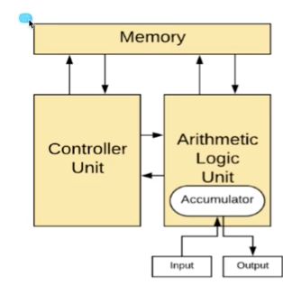

## 운영체제와 응용 프로그램

### 응용 프로그램이란?
* 프로그램 == 소프트웨어
* 소프트웨어 == 운영체제, 응용 프로그램(엑셀, 파워포인트, 기타 개발자가 개발한 프로그램)
* 응용 프로그램 == Application (일반 PC에서의 프로그램) == App (스마트
폰에서 응용 프로그램)

### 운영체제와 응용 프로그램간의 관계
* 운영체제는 **응용 프로그램**을 관리
    * 여기서의 관리는, 
    * 응용 프로그램을 실행시킨다.
    * 응용 프로그램간의 권한을 관리해준다. 
        * 예를들어 응용프로그램이 더 많은 권한이 필요할때, 관리자 권한으로 실행
    * 응용 프로그램을 사용하는 **사용자**도 관리
        * 예를들어 로그인 등이 있다.

### 운영체제와 응용 프로그램간의 관계
* 응용 프로그램은 누구나 만들 수 있다.
    * 이것이 문제가 되는 경우가 있다. 
        * 예를들어, 응용 프로그램에 무한 반복문을 넣는 등으로 응용 프로그램을 잘 못 작성하는 경우, 프로그램이 다운 시키는 등으로 운영체제가 권한을 가지고 있다.
        * 모든 파일 삭제 막기 (권한/사용자 관리) 
        * 응용 프로그램이 욕심이 많아서, CPU를 자기만 쓰겠다. 하는경우에도 운영체제가 막는다.
    * 그래서 운영체제는 응용 프로그램을 관리

### 운영체제와 응용 프로그램간의 관계
1. 응용 프로그램을 관리한다.
2. 시스템 자원(System Resource)를 관리한다.
3. 사용자와 컴퓨터간의 커뮤니케이션을 지원

> 운영체제의 목표: 사용자가 사용하는 응용 프로그램이 효율적으로, 적절
하게 동작하도록 지원
> 운영체제는 응용 프로그램이 요청하는 시스템 리소스를 효율적으로 분배
하고, 지원하는 소프트웨어

---

#### 쉬어가기: 운영체제는 어디에 있을까요?
> 운영체제는 저장매체(SSD/HDD)에 저장(설치)이 됩니다.

#### 컴퓨터 구조 복습
**컴퓨터를 키면?**
* 운영체제는 Memory에 올라게게 됩니다.(운영체제도 소프트 웨어이기 때문에)
* 참고: 폰노이만 구조
  

#### 정리
1. 운영체제의 역할: 시스템 자원, 응용 프로그램 관리, 효율적 분배
2. 응용 프로그램이란? ‑ 소프트웨어 (운영체제, 응용 프로그램)
    항상 응용 프로그램이 운영체제 위에서 실행이 된다.
