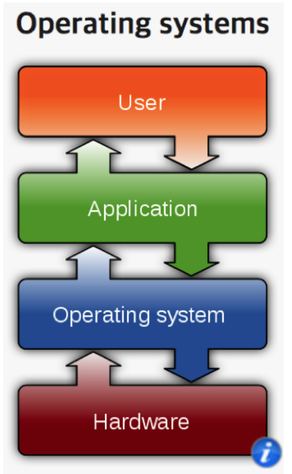

## 운영체제 구조 ‑ 시스템 콜

### 응용 프로그램, 운영체제, 컴퓨터 하드웨어(시스템 리소스) 관계

#### 운영체제를 도서관으로 비유 하자면,

* 운영체제: 도서관
* 응용 프로그램 : 시민
* 컴퓨터 하드웨어 :  책
* 운영체제의 역할
    * 시민은 도서관에 원하는 책(자원)을 요청함
    * 도서관은 적절한 책(자원)을 찾아서, 시민에게 빌려줌
    * 시민이 기한이 다 되면, 도서관이 해당 책(자원)을 회수함

### 응용 프로그램, 운영체제, 컴퓨터 하드웨어 관계

* 운영체제는 응용 프로그램이 요청하는 메모리를 허가하고, 분배한다.
* 운영체제는 응용 프로그램이 요청하는 CPU 시간을 제공한다.
* 운영체제는 응용 프로그래밍 요청하는 IO Devices 사용을 허가/제어한다.

### 사용자, 응용 프로그램, 운영체제, 컴퓨터 하드웨어와 관계

> **출처: 위키피디아** 

사용자는 가장 위에 있으며, 응용프로그램을 사용한던가, 실행을 요청한다.
이 응용 프로그램은 운영체제에게 시스템 자원을 사용하기 위해서 요청을 한다.
운영체제는 해당 자원을 하드웨에서 에플리케이션에게 빌려준다.

### 운영체제는 사용자 인터페이스 제공

* 쉘 (Shell)
    * 사용자가 운영체제 기능과 서비스를 조작할 수 있도록 인터페이스를 제공하는 프로그램 (예를들어, 터미널과 같은 프로그램)
    * 쉘은 터미널 환경(CLI)과, GUI 환경 두 종류로 분류
    * 
        * 응용프로그램 사용자 간의 의사소통하는 인터페이스를 쉘이 해준다.
        * 이러한 쉘 또한 사용자와 운영체제를 연결해주는 응용프로그램 중 하나이다.

### 운영체제는 응용 프로그램을 위해서도 인터페이스를 제공

* API (Application Programming Interface)
    * 함수로 제공 예를들어 C 언어의 open()
    * 보통은 다양한 함수가 있기 때문에, 라이브러리(library) 형태로 제공
        * C library
        * https://www.gnu.org/software/libc/
    * 함수의 집합 즉 , 요청서의 집합
    * 결국 shell도 운영체제가 제공해주는 API 를 이용해서, shell 이라는 프로그램을 만든다.
    shell은 사용자에게 API 를 입력받아 사용자에게 운영체제의 시스템자원을 제공해준다.
    마찬가지로, 애플리케이션 또한 이러한 API(요청서)를 이용해 운영체제의 자원을 사용한다.

### 운영체제는 응용 프로그램을 위해서도 인터페이스를 제공

#### 시스템 콜

* 시스템 콜 또는 시스템 호출 인터페이스
* 운영체제가 운영체제 각 기능을 사용할 수 있도록 시스템 콜이라는 명령 또는 함수를 제공
* API 내부에는 시스템콜을 호출하는 형태로 만들어지는 경우가 대부분
    * https://www.gnu.org/software/libc/

### 운영체제를 만든다면?

1. 운영체제를 개발한다. (kernel)
2. 시스템 콜을 개발
3. C API (library) 개발
4. Shell 프로그램 개발
5. 응용 프로그램 개발

### 운영체제와 시스템콜

* 시스템콜 정의 예
    POSIX API, 윈도우 API

> API: 각 언어별 운영체제 기능 호출 인터페이스 함수 (각 언어별 인터페이스)
> 시스템콜: 운영체제 기능을 호출하는 함수

### 정리
* 운영체제는 컴퓨터 하드웨어와 응용 프로그램을 관리한다.
* 사용자 인터페이스를 제공하기 위해 쉘 프로그램을 제공한다.
* 응용 프로그램이 운영체제 기능을 요청하기 위해서, 운영체제는 시스템 콜 을 제공한다.
    * 보통 시스템 콜을 직접 사용하기 보다는, 해당 시스템 콜을 사용해서 만든 각 언어별 라이브러리(API)를 사용한다.
