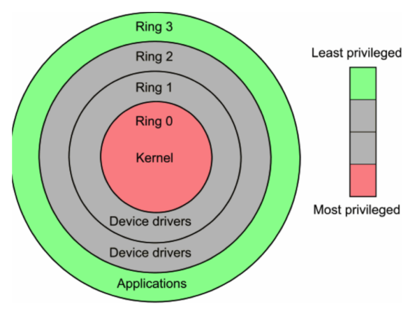
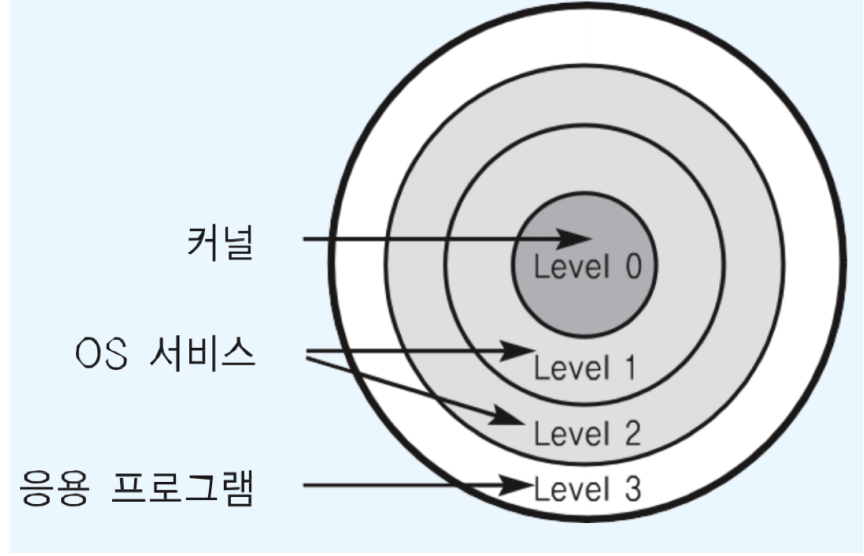
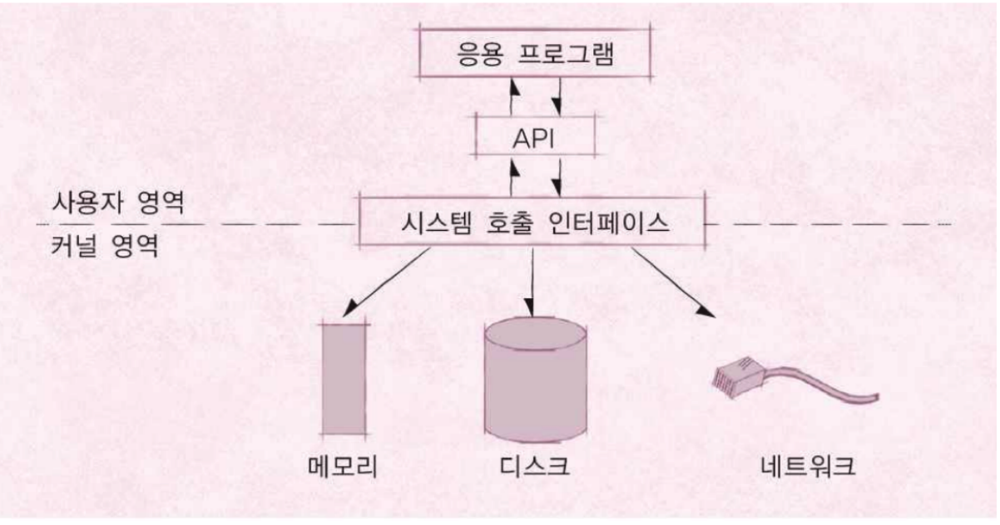
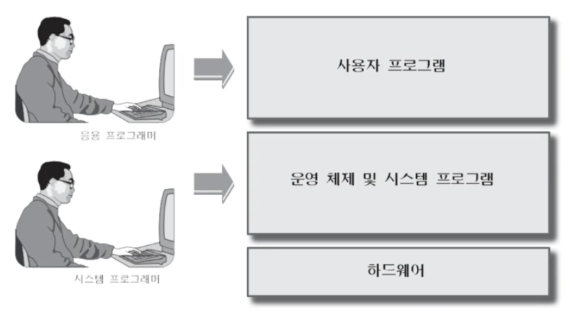

## 운영체제 구조 ‑ 사용자와 커널 모드

### CPU Protection Rings
* CPU도 권한 모드라는 것을 가지고 있다.
    * 사용자 모드 (user mode by applications)
    * 커널 모드 (kernel mode by OS) : 특권 명령어 실행과 원하는 작업
    수행을 위한 자원 접근을 가능케 하는 모드
    
    
* 두 가지 모드
    * 사용자 모드 (user mode): 응용 프로그램이 사용
    * 커널 모드 (kernel mode): OS가 사용
    

    즉, 어떠한 응용프로그램이 실행될 때 os는 지금의 모드를 채크해서, 
    해당 모드가 사용할 수 없는 범위인(os를 사용해야하는데 사용자 모드인 경우) 경우 응용프로그램을 실행 하지 않는다.

**kernel 이란? ‑ OS kernel**
* 사전적 정의로는
    1. (견과류·씨앗의) 알맹이
    2. (사상·주제의) 핵심

**shell 이란?**
* 사전적 정의로는
    1. (달걀견과류 등의 딱딱한) 껍데기
    2. 고둥 껍데기 모양의 것

### 응용 프로그램과 운영체제
우리가 만드는 프로그램은 맨위에서 놀고 있습니다.

### 시스템콜은 커널 모드로 실행
* 커널 모드에서만 실행 가능한 기능들이 있음
* 커널 모드로 실행하려면, 반드시 시스템 콜을 사용해야 함(거쳐야 함)
* 시스템 콜은 운영체제 제공

커널 모드에서 만 실행가능한 기능을 응용프로그램이 사용하려면 시스템콜을 통과해서 커널모드인 상태에서 CPU에서 실행이 된다.
만약 응용프로그램이 커널모드 상태가 아닌 상태에서 CPU 를 실행하려 해도 CPU 에서 실행이 되지 않는다.
이러한 동작이 잘 일어나기 위해서, OS 를 만들때 시스템 콜을 잘 만들어야 한다.

### 사용자 모드와 커널 모드
* 함부로 응용 프로그램이 전체 컴퓨터 시스템을 헤치지 못함
* 주민등록등본은 꼭 동사무소 또는 민원24시(정부 사이트)에서 특별한 신청서를 써야만, 발급
    * 동사무소 직원분들은 특별한 권한을 가지고, 주민등록등본 출력 명령을 실행

**응용 프로그래머와 시스템 프로그래머**

### 정리
* 운영체제는 **시스템 콜** 제공
* 프로그래밍 언어별로 운영체제 기능을 활용하기 위해, 시스템 콜을 기반으로 **API** 제공
* 응용 프로그램은 운영체제 기능 필요시, 해당 **API**를 사용해서 프로그램을작성
* 응용 프로그램이 실행되서, 운영체제 기능이 필요한 **API**를 호출하면, 시스템 콜이 호출되서, **커널 모드로 변경되어** OS 내부에서 해당 명령이 실행되고, 다시 응용 프로그램으로 돌아간다.
