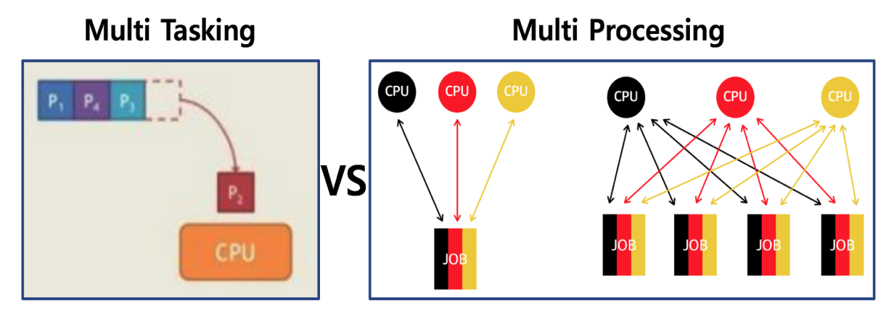

## 프로세스 스케쥴링

배치 처리 시스템, 시분할 시스템, 멀티 태스킹

### 배치 처리 시스템

- 일괄 처리, 배치 처리, batch processing 이라고 부름
- 컴퓨터 프로그램 실행 요청 순서에 따라 순차적으로 프로그램을 실행하는 방식
- 한번에 등록된 여러 프로그램을 순차적으로 실행 가능

**Queue** : First in > First out

### 배치 처리 시스템과 시분할 시스템/멀티 프로그래밍

- 여러 프로그램을 순차적으로 실행시킬 수 있도록 해주세요. 라는 요구 때문에 나타났다.
    - 하지만, 다음과 같은 문제가 있었다.
    - 어떤 프로그램은 실행이 너무 시간이 많이 걸려서, 뒤에 나오는 다른 프로그램이 실행하는데 시간을 많이 기다려야 한다.
    - MP3 음악을 들으면서, 문서 작성을 하고 싶어요! (즉, 동시에 여러 응용 프로그램 실행)
    - 여러 사용자가 동시에 하나의 컴퓨터를 쓰려면 어떻게 해야 하나요?(다중 사용자 지원)

> 멀티 프로그래밍/시분할 시스템이 나왔다

### 시분할 시스템

* 시분할 시스템: 다중 사용자 지원을 위해 컴퓨터 응답 시간을 최소화하는 시스템

### 멀티 태스킹
* 멀티 태스킹: 단일 CPU에서, 여러 응용 프로그램이 동시에 실행되는 **것 처럼** 보이도록 하는 시스템
    * 나는 MP3 음악을 들으며, 문서 작성을 한다.

#### 실제 멀티 태스킹

* 1000 밀리초(ms) = 1 초
* 10 ~ 20 ms 단위로도 실행 응용 프로그램이 바뀌더라
* 사용자에게는 동시에 실행되는 것처럼 보임
    

#### 멀티 태스킹과 멀티 프로세싱
* 
    출처: http://donghoson.tistory.com/15
* 멀티 태스킹: 단일 CPU
* 멀티 프로세싱: 여러 CPU에 하나의 프로그램을 병렬로 실행해서 실행속도를 극대화시키는 시스템

### 정리
* 배치 처리 시스템: 순차적으로 실행
* 시분할 시스템: 다중 사용자 지원, 응답시간 최소화 시스템
* 멀티 태스킹: 동시 실행하는 것 처럼 보이도록 하는 시스템
* 멀티 프로세싱: 여러 CPU에 하나의 프로그램을 병렬로 실행시키는 시스템
