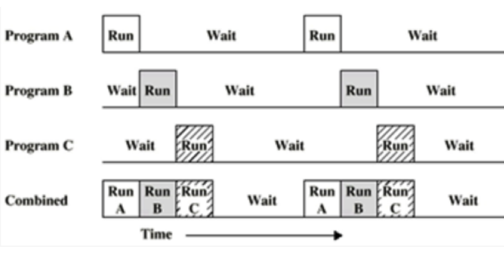
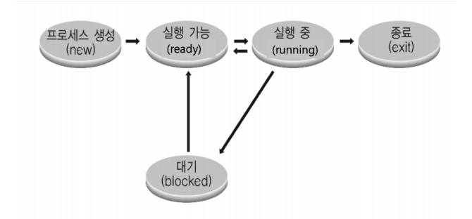
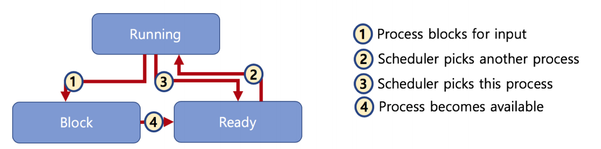
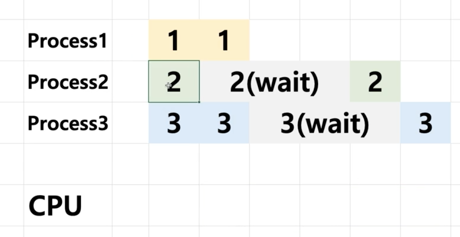

## 프로세스 상태와 스케줄링

### 멀티프로그래밍과 Wait
* 멀티 프로그래밍 : CPU 활용도를 극대화 하는 스케쥴링 알고리즘
* Wait : 간단히 저장매체로 부터 파일 읽기를 기다리는 시간으로 가정

### 프로세스 상태 

어느시점에 어떤프로그램을 넣을까를 결정하는데에 프로세스 상태가 중요한 정보가 된다.
* running state : CPU에서 실행 상태
* ready state : CPU에서 실행 가능한 상태(실행대기 상태)
* block state : 특정 이벤트 발생 대기 상태 (예: 저장매체에서 파일을 읽는 중인 상태 등)
* 프로세스 생성
* 프로세스 종료

### 프로세스 상태 관계

* ready, running, block states

1. 프로세스가 러닝을 하다가 특정이벤트 대기를 한다.(파일 읽기)
2. Ready 상태에서 스케줄러에게 선택 받아 Running(실행) 된다.
3. Running 상태에서 특정한 시점이 되어, 다른프로세스로 변경하기 위해 Ready 상태로 바꾸어 준다.
4. 스케줄러에게 Running 상태로 바꾸어도 된다고 알려주기 위해서 , Ready 상태로 바뀐다.

> OS.xlsx -> Procsee Status(BASIC) & (QUEUE)

이러한 경우 CPU를 어떻게 사용하고, 각각의 프로세스의 상태는 무엇인가? (ready, running, block) 