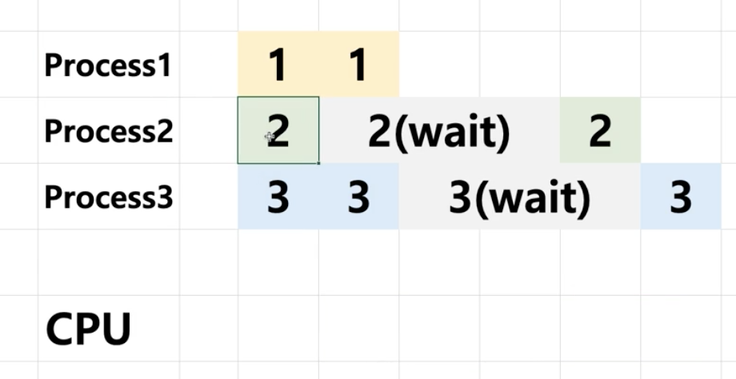
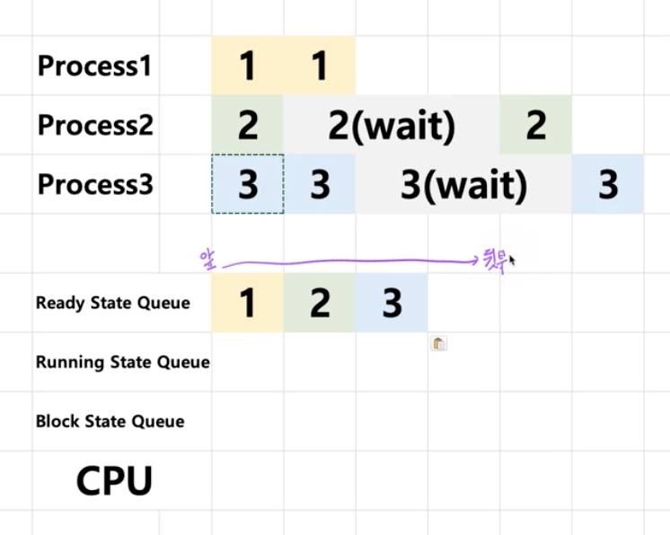
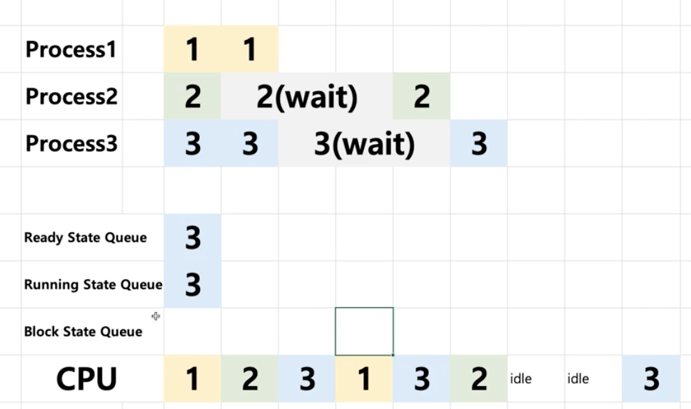

## 프로세스 상태와 스케줄링

이러한 경우 CPU를 어떻게 사용하고, 각각의 프로세스의 상태는 무엇인가? (ready, running, block) 

3가지 상태에 따라 Queue를 만든다. (Queue는 FIIO 의 정책을 따른다.)
이러할 때, CPU는 ready Queue에서 하나를 꺼내 실행하고 running Queue에 넣으면 된다.

이러한 Queue 는 몇가지 정책에 의해 순서가 바뀔 수 있다.
예를들어 우선순위 정책, SJF 등의 정책이 있을 수 있다.

