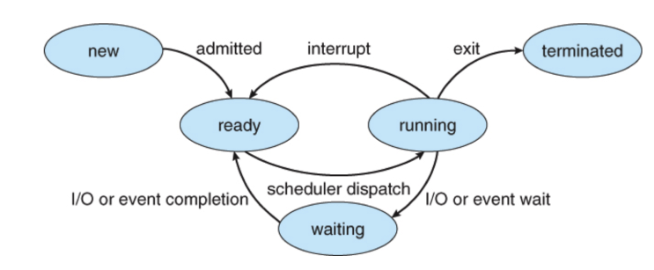
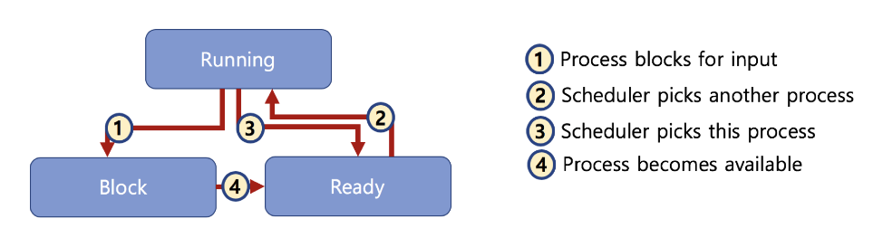

## 스케쥴링알고리즘

### 선점형과 비선점형 스케쥴러
* 선점형스케쥴러(PreemptiveScheduling)                       
  :하나의 프로세스가 다른 프로세스 대신에 프로세서(CPU)를 차지할수 있음 (구현하기 어려움)
  
* 비선점형스케쥴러(Non‑preemptiveScheduling) 
  :하나의 프로세스가 끝나지 않으면 다른 프로세스는 CPU를 사용할 수 없음

### 선점형과 비선점형 스케쥴러차이
* 비선점형: 프로세스가 자발적으로 blocking 상태로 들어가거나, 실행이 끝났을 때만, 다른 프로세스로 교체 가능
* 선점형: 프로세스 running 중에 스케쥴러가 이를 중단시키고, 다른 프로세스로 교체 가능 

> OS.xlsx‑> Preemptive

### 스케쥴러구분
* FIFO(FCFS), SJF, Priority‑based는 어떤 프로세스를 먼저 실행 시킬지에 대한 알고리즘
* RoundRobin은 시분할 시스템을 위한 기본 알고리즘 (선점형 스케쥴러)
  
### 가볍게 듣기
랙?:마우스/ 키보드 반응이 느린 경우?
> 스케쥴러가 해결해야 하는 이슈! 
> 다양하고 복잡한 스케쥴링 알고리즘 필요

* 리눅스스케쥴러: O(1), CFS와 같이 다양한 방식으로 변경 시도중 
    * 인터렉티브, IO, CPU 중심 프로세스로 미리 구분할 수 있다면 보다 개선된 스케쥴링이 가능함