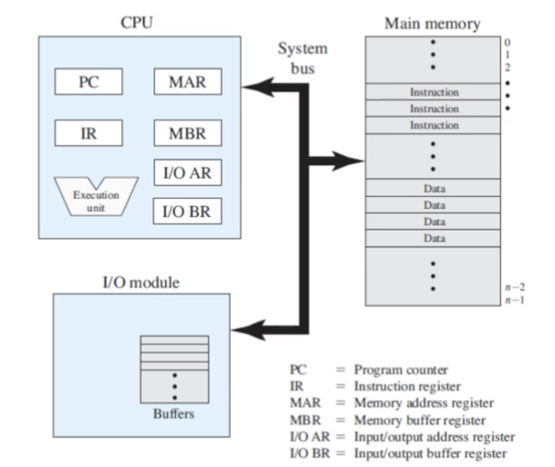
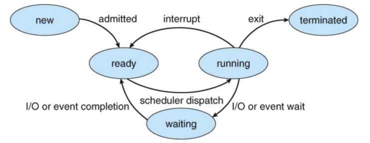

## 인터럽트

### 인터럽트란?
* CPU가 프로그램을 실행하고 있을 때, 입출력 하드웨어 등의 장치나 또는 예외 상황(이벤트)이 발생하여 *처리*가 필요할 경우에 CPU에 알려서 처리하는 기술
  
> 어느 한순간 CPU가 실행하는 명령을 하나이다.
> 다른 장치와 어떻게 커뮤니케이션을 할까요?

**컴퓨터의 CPU 기본 구조**

* 프로그램이 실행되면, 코드를 pc 에서 한줄씩 실행한다. 
    그러다, *open()* 등의 파일을 읽는 행위(block 상태) 가 되었다가 
    파일 읽기가 끝나면 누가 파일읽기가 끝났다고 이야기 해주는가?? (ready 상태가 되었다고 이야기 해주는가?)

    > 이것이 인터럽트가 하는 일 이다. 
    > 즉,이벤트 발생하여 처리를 할때를 인터럽트라고 한다.
  

### 인터럽트 필요 이유
* 선점형 스케쥴러 구현
    * 프로세스 runnung중에 스케쥴러가 이를 중단시키고, 다른 프로세스로 교체하기 위해, 현재 프로세스 실행을 중단시킴
        * 그러려면, 스케쥴러 코드가 실행이 되서, 현 프로세스 실행을 중단 시켜야 함 

* IO Device와의 커뮤니케이션
    * 저장매체에서 데이터 처리 완료시, 프로세스를 깨워야 함 (block state > ready state)
  

  
* 예외 상황 핸들링
    * CPU가 프로그램을 실행하고 있을 때, 입출력 하드웨어 등의 장치나 또는 예외상황이 발생할 경우, CPU가 해당 처리를 할 수 있도록 CPU에 알려줘야 함