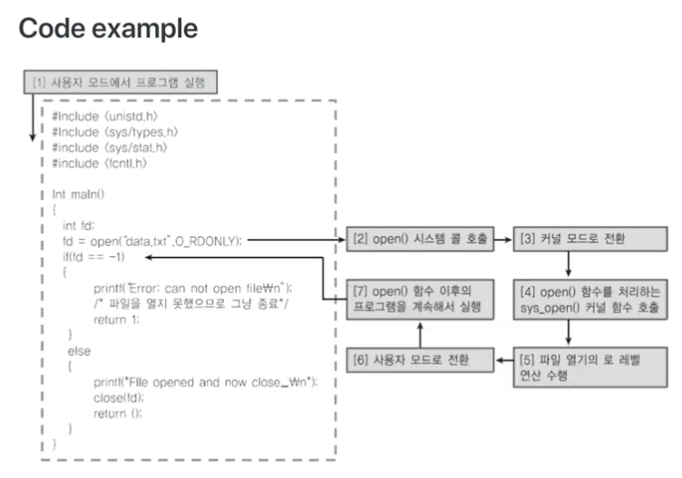
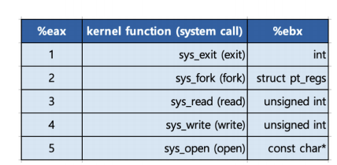
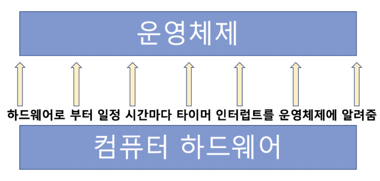

## 인터럽트 처리구조

### 시스템콜 인터럽트 
* 내부적으로 인터럽트 방식으로 처리를 한다.
    
* 시스템콜 실행을 위해서는 강제로 코드에 인터럽트 명령을 넣어, CPU에게 실행시켜야 한다.

* 
    ~~~
    mov eax, 1
    mov ebx, 0
    int 0x80 //소프트웨어 인터럽트 명령
    ~~~
    * eax 레지스터에 시스템 콜 번호를 넣고,
    * ebx 레지스터에는 시스템 콜에 해당하는 인자 값을 넣고,
    * 소프트웨어 인터럽트 명령을 호출하면서 0x80 값을 넘겨줌

### 인터럽트와 시스템 콜(고급)
* 시스템콜 인터럽트 명령을 호출하면서 0x80값을 넘겨줌
    1. CPU는 사용자 모드를 커널 모드로 바꿔줌
    2. IDT에서 0x80에 해당하는 주소(함수)를 찾아서 실행한다.
    3. system_call() 함수에서 eax로부터 시스템 콜 번호를 찾아서, 해당번호에 맞는 시스템콜 함수로 이동
    4. 해당 시스템콜 함수 실행 후, 다시 커널 모드에서 사용자 모드로 변경하고, 다시 해당 프로세스 다음코드 진행

        

### 사용자/커널 모드와 프로세스, 인터럽트
* 
    *  프로세스A 가 실행을 하다가 System call 을 호출한다, 
    CPU는 커널모드로 바꾼다. 
    커널모드에서 system call에 해당하는 함수를 실행한다.
    그 후 다시 사용자 모드로 돌아와 프로세스A 를 실행한다.
    Timer interrupt 에 따라, 프로세서 스케쥴러가 프로세스흫 바꾸어 (커널모드)
    프로세스B 를 실행한다.

### 인터럽트와 IDT
* 인터럽트는 미리 정의되어 각각 번호와 실행코드를 가리키는 주소가 기록되어 있음
    * 어디에? IDT에 기록
    * 언제? 컴퓨터 부팅시 운영체제가 기록
    * 어떤코드? 운영체제 내부 코드

* 예를들어, 
    * 항상 인터럽트 발생시, IDT를 확인
    * 시스템콜 인터럽트 명령을 0x80 번호가 미리 정의
    * 인터럽트 0x80 에 해당하는 운영체제 코드는 system_call()이라는 함수
    * 즉, IDT에는 0x80 -> system_call() 와 같은 정보가 기록되어 있음
  
* 리눅스는, 
    * 0 ~ 31 : 예외상황 인터럽트 (일부는 정의안된 채로 남겨져 있음)
    * 32 ~ 47 : 하드웨어 인터럽트 (주변장치 종류/갯수에 따라 변경가능)
    * 128 : 시스템 콜
  
### 인터럽트와 프로세스
1. 프로 실행 중 인터럽트 발생
2. 현 프로세스 실행 중단 ( 커널모드로 변경 후, idt 에서 해당하는 번호의 함수를 찾음)
3. 인터럽트 처리 함수 실행 (운영체제)
4. 현 프로세스 재실행

### 인터럽트와 스케쥴러
> 선점형 스케쥴러 구현 예
* 수시로 타이머 인터럽트 발생
    * 운영체제가 타이머 인터럽트 발생 횟수를 기억해서 5번 타이머 인터럽트 발생하면, 현재 프로세스를 다른 프로세스로 바꿔준다.
  
