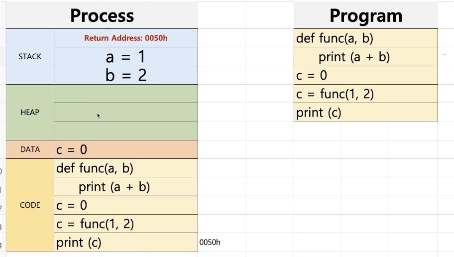
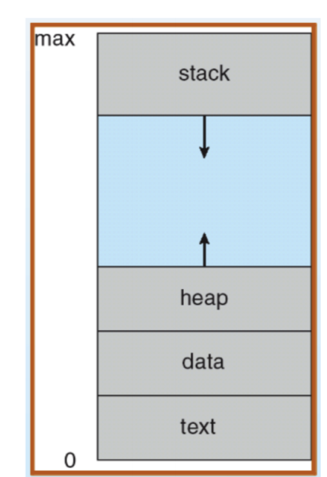
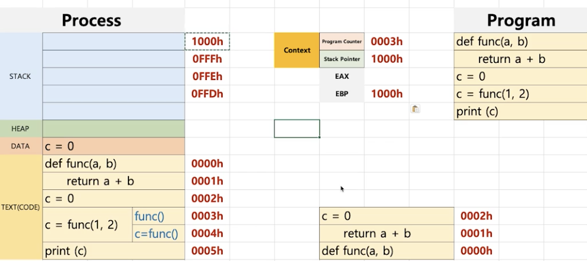
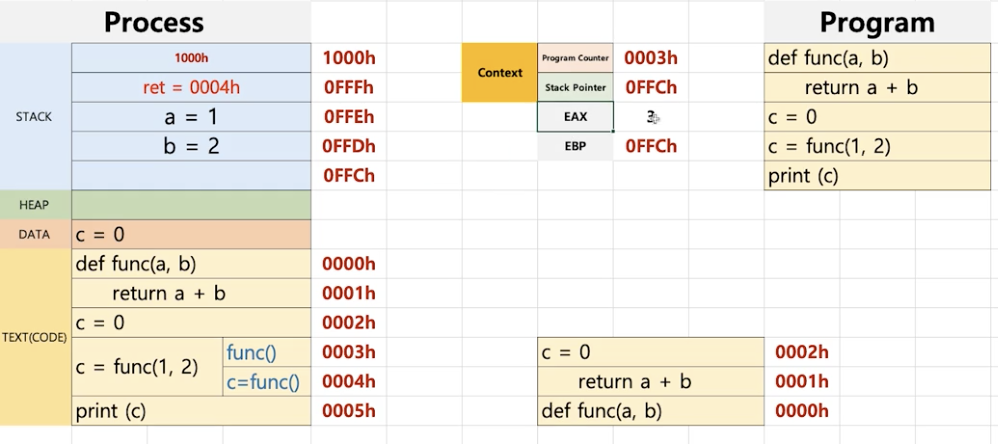
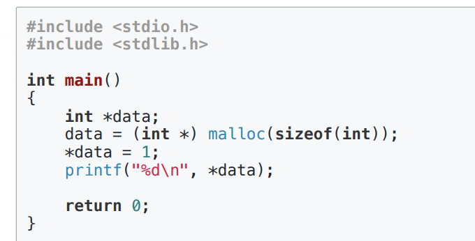
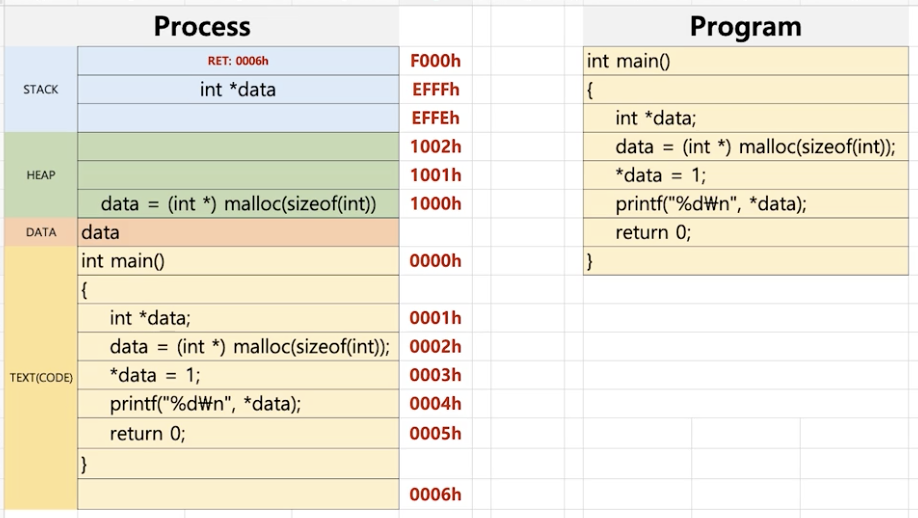

## 프로세스와 컨택스트 스위칭
23

A 라는 프로세스가 실행을 하다가 스케줄러가 B로 바꿔준다. 
바꿔주는 매커니즘을 컨텍스트 스위칭이라고 한다.

프로그램을 작성할때, 실제 실행파일의 구조를 이해해야 할때가 있다.(에를 들어 디버깅)그러할때, 이러한 구조를 알아야 한다.

### 프로세스 구조 deep dive

코드를 한줄씩 컴파일 한다. 하면, 이것은 컴퓨터가 이해 할 수 있는 0과 1로 변환이 된다는 의미 이다.
process 의 **Code**라는 영역에 이러한 컴파일된 소스 코드가 저장되게 된다.
변수를 선언 할때 데이터를 process 의 **Data** 에 저장해 놓는다.
함수를 실행 할때마다 동적으로 함수 내부의 공간을 만들던지 어떠한 처리를 해야 한다. 이것을 넣어 놓는 공간이 **Stack** 이다.
**Heap** 의 경우 c언어의 malloc()가 대표적인데 동적으로 특정 메모리 공간을 생성한다. 

----
24

### 프로세스와 컨텍스트 스위칭

* 프로세스(process)는 일반적으로 어떻게 구성되어 있을까?
    * text(code): 코드 
    * data: 변수/초기화된 데이터
    * stack: 임시 데이터(함수 호출,로컬 변수 등)
    * heap: 코드에서 동적으로 만들어지는 데이터

> OS.xlsx -> ProcessStructure

**자료구조에서의 스텍**
* 스택(stack) 
    * 이 자료구조는 뭐에 쓰이고 왜 강조해서 배웠나?
    * '스택 프래임'

#### 프로세스와 컴퓨터 구조 복습
* 프로세스(process)는 일반적으로 어떻게 동작할까? - 컴퓨터 구조도 복습
    * text: 코드
    * data: 변수/초기화된 데이터
    * stack: 임시 데이터(함수 호출, 로컬 변수등)
    * heep: 코드에서 동적으로 만들어지는 데이터

* PC(program Counter) + SP(Stack Pointer)

PC와 SP가 어떻게 프로세스 구조와 엮어서 동작이 되는지

--
25

#### Heap 이란?

