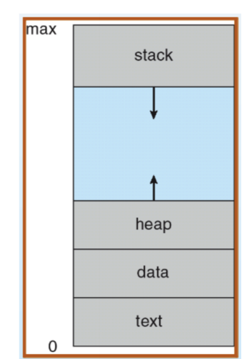
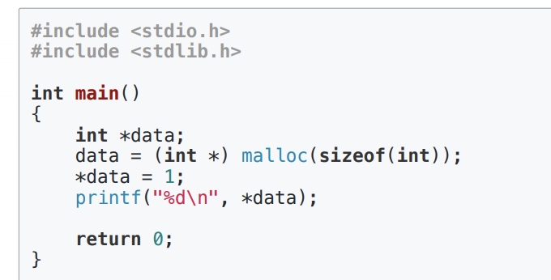
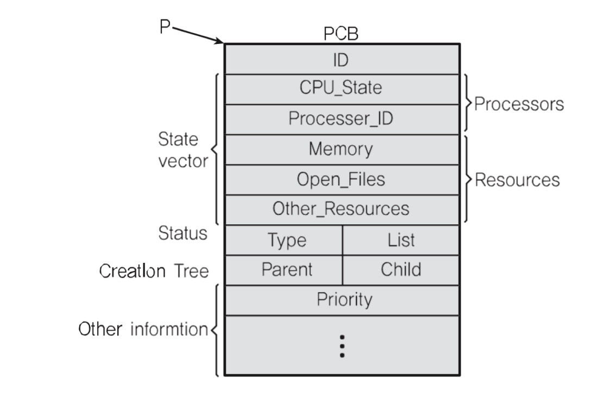

## 프로세스와 컨택스트 스위칭

### 프로세스 구조 deep dive

### 프로세스와 컨텍스트 스위칭
* 프로세스(process)는 일반적으로 어떻게 구성되어 있을까?
    * text(code): 코드 
    * data: 변수/초기화된 데이터
    * stack: 임시 데이터(함수 호출,로컬 변수 등)
    * heap: 코드에서 동적으로 만들어지는 데이터

> OS.xlsx -> ProcessStructure

**자료구조에서의 스텍**
* 스택(stack)
    * 이 자료구조는 뭐에 쓰이고 왜 강조해서 배웠나?

#### 프로세스와 컴퓨터 구조 복습
* 프로세스(process)는 일반적으로 어떻게 동작할까? - 컴퓨터 구조도 복습
    * text: 코드
    * data: 변수/초기화된 데이터
    * stack: 임시 데이터(함수 호출, 로컬 변수등)
    * heep: 코드에서 동적으로 만들어지는 데이터

* PC(program Counter) + SP(Stack Pointer)

#### Heap 이란?

### 프로세스 구조 : Stack, HEAP, DATA(BSS,DATA), TEXT(CODE)
> DATA를 BSS와 DATA로 분리

출처 : http://www.drdobbs.com/security/anatomy-of-a-stack-smashing-attack-and-h/240001832

**스택오버 플로우**
 : 주로 헤커들의 공격에 활용 되었음

#### 프로세스와 컨텍스트 스위칭

#### PCB 
> PC, SP는 어디에 저장하나?

#### Process Control Block 에 저장!
> Process Control Block 이라고도 함

1. Porcess ID
2. Register(PC, SP 등)
3. Scheduling info(porcess State) 
4. Memory info(메모리 사이즈 limit) 

##### PCB: 리눅스 예

### 정리
* 프로세스 구조
    * Stack, HEAP, DATA(BSS,DATA), TEXT(CODE)

* PCB 
    * 프로세스 상태 정보 - PC, SP , 메모리, 스케쥴링 정보등 