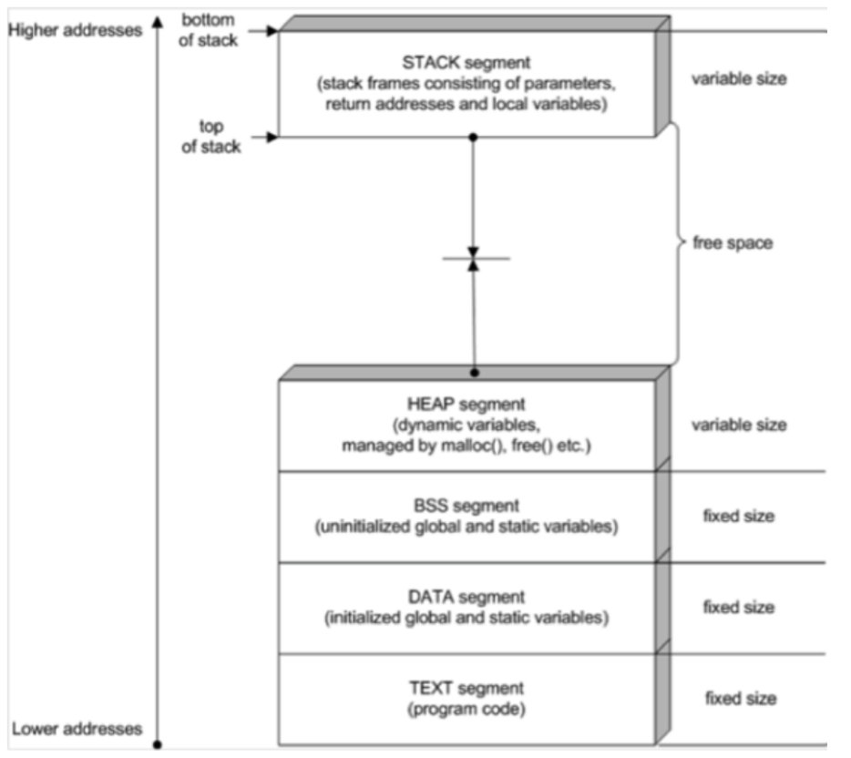

### 프로세스 구조 : Stack, HEAP, DATA(BSS,DATA), TEXT(CODE)
> DATA를 BSS와 DATA로 분리

data 영역은 두가지로 분리된다.
* BSS : 초기화 되지 않은 전역변수 
* DATA : 초기화 된 전역변수

~~
int global_data1; // BSS
int global_data2 = 1; // DATA

int main(){
    int *data; // 지역변수로써 stack 안에 들어간다.
    ...
}
~~

**스택오버 플로우** : 주로 헤커들의 공격에 활용 되었음

출처 : http://www.drdobbs.com/security/anatomy-of-a-stack-smashing-attack-and-h/240001832