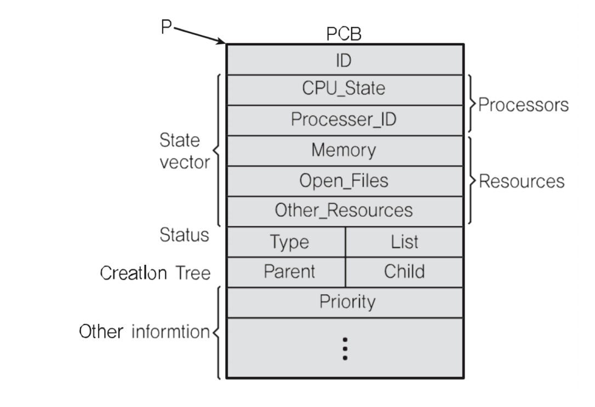

#### 프로세스와 컨텍스트 스위칭

* **PC**(program Counter) + **SP**(Stack Pointer)
* Stack, HEAP, DATA(BSS,DATA), TEXT(CODE)

#### PCB 
> PC, SP는 어디에 저장하나?
**Process Control Block 에 저장!**
Process Control Block 이라고도 함
1. Porcess ID
2. Register(PC, SP 등)
3. Scheduling info(porcess State) 
4. Memory info(메모리 사이즈 limit) 

> PCB: 프로세스가 실행중인 상태를 캡쳐/구조화 해서 저장

##### PCB: 리눅스 예

### 정리
* 프로세스 구조
    * Stack, HEAP, DATA(BSS,DATA), TEXT(CODE)

* PCB 
    * 프로세스 상태 정보 - PC, SP , 메모리, 스케쥴링 정보등 