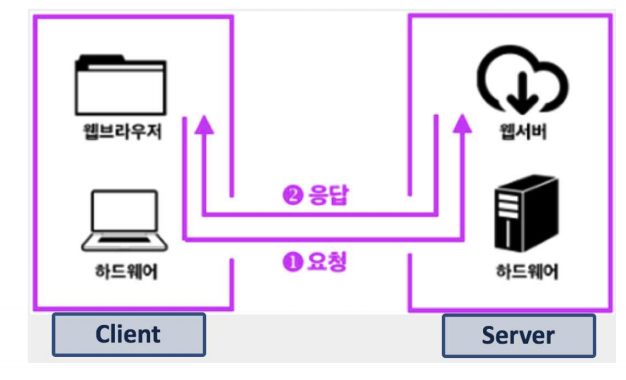

## 프로세스간 커뮤니케이션

### InterProcess Communication

프로세스간 직접적으로 통신을 할 수 없기 때문에, 
통신을 하기 위해서 특별한 IPC를 사용하라고 정의 해놨다.

**왜 필요한가?**
* 프로세스들이 서로의 공간을 쉽게 접근할 수 있다면? 
    * 프로세스 데이터/코드가 바뀔 수 있으기 때문에 위험하다

* 프로세스는 다른 프로세스의 공간을 접근할 수 없다. (제공하면 안된다.)
  
http://www.drdobbs.com/security/anatomy-of-a-stack-smashing-attack-and-h/240001832

### ICP(interprocess Communication)

* 프로세스간에 커뮤니케이션을 해야한다면 어떻게 해야할까?
    * 프로세스간 통신 방법을 제공함
    * IPC: InterProcess Communcation

### 프로세스간 통신이 필요한가?

* 성능을 높이기 표 위해 여러 프로세스를 만들어서 동시 실행 (CPU 의 코어가 많아 지면서)
* 이 때 프로세스간 상태 확인 및 데이터 송수신이 필요

#### 예시1
* fork() 시스템콜
    * fork() 함수로 프로세스 자신을 복사해서 새로운 프로세스로 만들 수 있음
        * 부모 프로세스(함수를 호출한), 자식 프로세스(함수를 통해 만들어진)
  
* 프로세스를 fork()해서,여러 프로세스를 동시에실행시킬 수 있음
>   CPU가 한 개일때만 생각하지만,
>  최근에는 CPU 안에 코어가 8개 되는 경우도 많고, 각 프로세스를 각 코어에동시 실행 가능 (병렬 처리)

* 여러 프로세스 동시 실행하기 예
    * 1~10000까지 더하기
        * fork() 함수로 10개프로세스 만들어서 , 각각 1~1000,1001~ 2000,…더하기
        * 각 각 더한 값을 모두 합하면, 더 빠르게 동작 가능
  
> **단, 이 때 각 프로세스가 더한 값을 수집해야 하므로, 프로세스간 통신 필요**

#### 예시2

* 웹서버와 클라이언트 서버 간의 통신
    * 새로운 사용자 요청이 올 때마다, fork() 함수로 새로운 프로세스 만들고, 각 사용자 요청에 즉시 대응
> CPU 병렬 처리가 가능하다면, 더 빠른 대응이 가능
> 단, 이 때 각프로세스 제어 및 상태 정보 교환을 위해 프로세스간 통신 필요