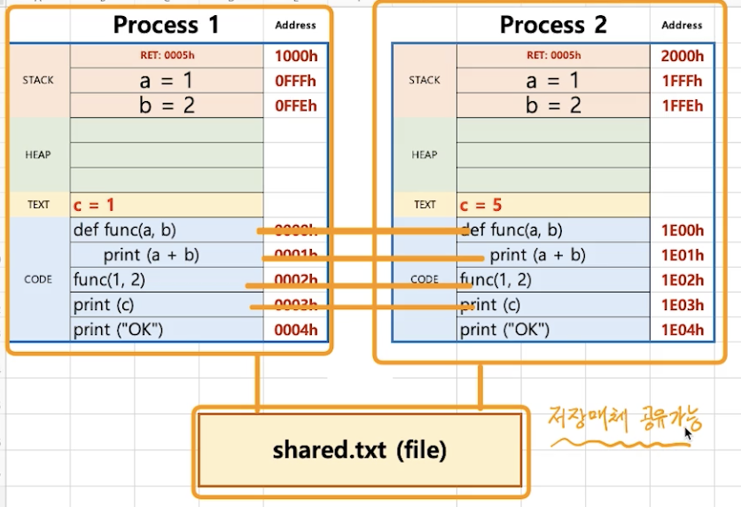
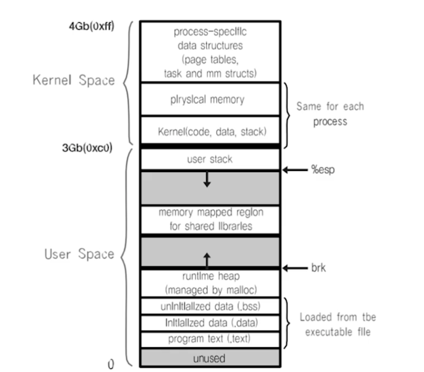
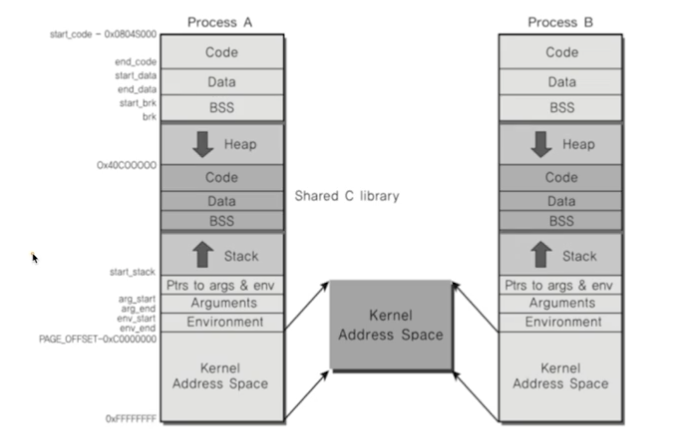

### 파일을 사용한 커뮤니케이션
> 프로세스간에커뮤니케이션을 해야한다 어떻게 해야할까?
* 프로세스간 통신 방법을 제공함
* IPC 
    * 그 중의 한가지 방법 :file 사용

> 간단히 다른 프로세스에 전달할 내용을 파일에쓰고, 다른 프로세스가 해당 파일을 읽으면 됨

### 프로세스간 커뮤니케이션
* file을 사용하면, 실시간으로 직접 원하는 프로세스에 데이터 전달어려움 
    * 왜? 해당 프로세스가 파일을 읽어야 하는데, 계속 실시간으로 읽고 있을 수는 없다.
    * 또한, 저장매체를 사용하는것은 메모리를 사용하는것 보다 느리다.
  
> 그래서 보다 다양한 IPC 기법이 있음

### 실제 프로세스: 리눅스 예
* 프로세스간 공간은 완전히 분리되어 있다.
    * 사용자 모드에서는 커널 공간 접근 불가

* 커널 공간은 공유한다.
    * 보다 구체적인 내용은 가장 메모리에서 다룸

### 다양한 IPC 기법

* IPC

1. file 사용
2. Message Queue
3. Shared Memory
4. Pipe
5. Signal
6. Semaphore
7. Socket
   
> 2번부터는 모두 커널 공간을 사용하는 것임 - 이것이 핵심

### 정리
* 여러 프로세스 동시 실행을 성능 개선, 복잡한 프로그램을 위해 프로세스간 통신 필요
* 프로세스간 공간이 완전 분리
* 프로세스간 통신을 위한 특별한 기법 필요
    * IPC 
* 대부분의 IPC 기법은 결국 커널 공간을 활용하는 것임
    * 이유 : 커널 공간을 공유하기 때문
